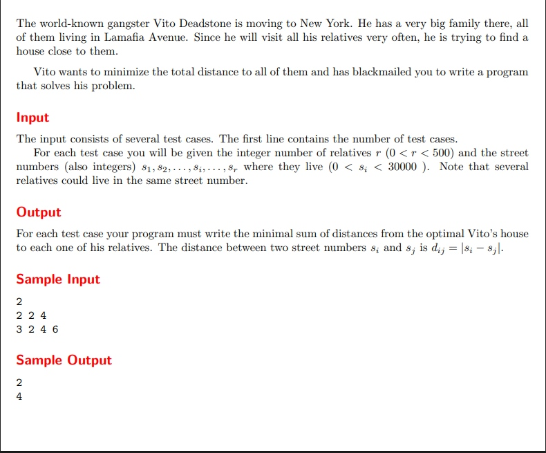

# Vito’s Family

題目連結:[Vito’s Family](https://onlinejudge.org/index.php?option=com_onlinejudge&Itemid=8&page=show_problem&problem=982)



題目的目標是要找到一個離 s1, s2, s3.... sn 總距離最近的 street number，換句話說要找到一個與 s1~sn 相減後取絕對值加起來最小的數字，也就是 s 的中位數。

以 sample 來看，[2, 4] 的中位數為 (2+4)/2 = 3, abs(2-3) + abs(4-3) = 1+1=2,
[2, 4, 6] 的中位數為 4, abs(4-2) + abs(4-4) + abs(6-4) = 4

再來是解題的流程

1. 用 array 裝 street numbers

```C
int r_street[MAX_SIZE];

        for(int i = 0; i < r; i++){
            scanf("%d", &r_street[i]);
        }
```
MAX_SIZE 為題目給的限制 30000
2. 排序 street numbers

```C
void bubble_sort(int arr[], int len){
    for(int i = 0; i < len; i++){
        for(int j = i+1; j < len; j++){
            if(arr[i] > arr[j]){
                int temp = arr[i];
                arr[i] = arr[j];
                arr[j] = temp;
            }
        }
    }
}
```
這邊用 bubble sort
3. 找中位數
```C
        if(r%2 == 1){
            new_add = r_street[r/2];
        }
        else{
            new_add = (r_street[r/2]+r_street[r/2-1]) / 2;
        }
```
注意要分成 array 內為奇偶數的不同情況找中位數

4. 計算絕對值相減
```C
        for(int i = 0; i < r; i++){
            distance += abs(new_add - r_street[i]);
        }
```
這邊有用到 `abs()`，所以要記得在前面 include <stdlib.h>
5. 輸出
```C
printf("%d\n", distance);
```

```
#include <stdio.h>
#include <stdlib.h>
#define MAX_SIZE 30000
void bubble_sort(int arr[], int len){
    for(int i = 0; i < len; i++){
        for(int j = i+1; j < len; j++){
            if(arr[i] > arr[j]){
                int temp = arr[i];
                arr[i] = arr[j];
                arr[j] = temp;
            }
        }
    }
}

int main(){
    int t;
    scanf("%d", &t);

    while(t--){
        int r;
        scanf("%d", &r);

        int r_street[MAX_SIZE];

        for(int i = 0; i < r; i++){
            scanf("%d", &r_street[i]);
        }

        bubble_sort(r_street, r);
        
        int new_add;
        if(r%2 == 1){
            new_add = r_street[r/2];
        }
        else{
            new_add = (r_street[r/2]+r_street[r/2-1]) / 2;
        }
        int distance = 0;

        for(int i = 0; i < r; i++){
            distance += abs(new_add - r_street[i]);
        }

        printf("%d\n", distance);

    }
} 
```