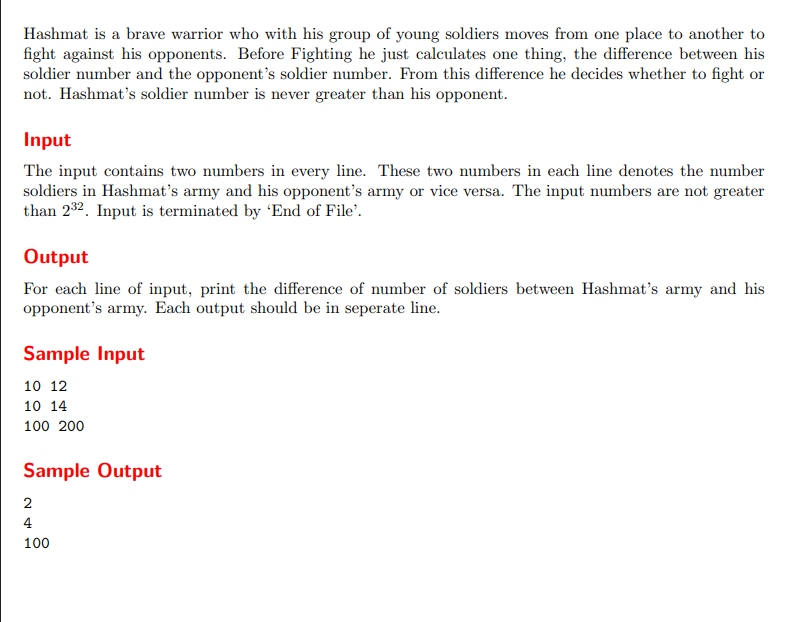

# Hashmat the Brave Warrior

題目連結:[Hashmat the Brave Warrior](https://onlinejudge.org/index.php?option=com_onlinejudge&Itemid=8&page=show_problem&problem=996)


這題在 cpe 1星題中算特別簡單的題目，只要回傳兩個值相減的絕對值即可。
比較要注意的是 scanf 到 'EOF' 才終止，這類型的輸入方式在很多題目都很常見。

```C
#include <stdio.h>
#include <math.h>

int main(){
    int a, b;
    while(scanf("%d%d", &a, &b) != EOF){
    printf("%d\n", abs(a-b));
    }
}
```