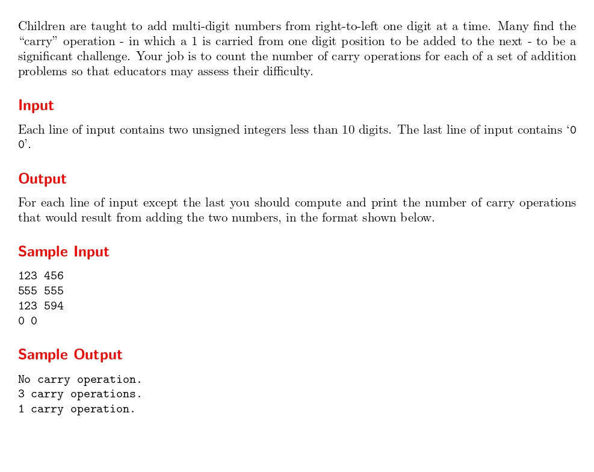

# Primary Arithmetic

題目連結: (Primary Arithmetic)[https://onlinejudge.org/index.php?option=com_onlinejudge&Itemid=8&category=33&page=show_problem&problem=976]


這題會給兩個數字(最高十位數)，問在兩數相加時會執行幾次進位。

```C
while(a != 0 || b != 0){
    if(a%10 + b%10 + carry >= 10){
        carry_count++;
        carry = 1;
    }
    else{
        carry = 0;
    }
    a /= 10;
    b /= 10;
        }
```
輸入數字後，我們先從個位數開始執行，當兩數相加大於 10 就算執行一次進位。
在進位的時候下一個位數會再加 1，所以我們設定一個類似 flag 的 carry = 0，當進位的時候設成 1，沒有設成 0，再加入 if 內做進位判斷。

```C
#include <stdio.h>

int main(){
    int a, b;
    while(scanf("%d%d", &a, &b) && a != 0 || b != 0){
        int carry_count = 0, carry = 0;
        while(a != 0 || b != 0){
            if(a%10 + b%10 + carry >= 10){
                carry_count++;
                carry = 1;
            }
            else{
                carry = 0;
            }
            a /= 10;
            b /= 10;
        }
        if(carry_count == 0){
            printf("No carry operation.\n");
        }
        else if(carry_count == 1){
            printf("1 carry operation.\n");
        }
        else{
            printf("%d carry operations.\n", carry_count);
        }
    }
}
```

後面輸出還有分成 0, 1, 1以上要做不同輸出訊息的細節。