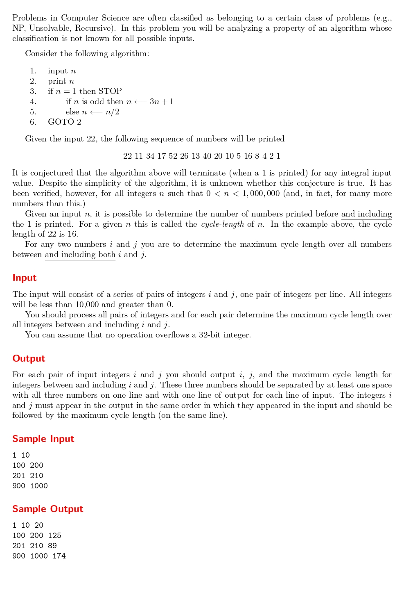

# The 3n + 1 problem

題目連結: (The 3n + 1 problem)[https://onlinejudge.org/index.php?option=com_onlinejudge&Itemid=8&page=show_problem&problem=36]



題目首先列出了一個演算法(3n+1): 輸出n，若 n 為奇數回傳 3n+1，n為偶數回傳 n/2，直到 n=1 為止。在終止前印出的數列長度稱為 cycle length。
可以觀察到它是以遞迴的方式運作。我們首先實作此演算法:

```C
int algo_cycle_len(int n, int cycle_len){
    if (n == 1){
        cycle_len++;
        return cycle_len;
    }
    else if(n % 2 == 1){
        cycle_len++;
        return algo_cycle_len(n*3 + 1, cycle_len);
    }
    else{
        cycle_len++;
        return algo_cycle_len(n/2, cycle_len);
    }
}
```

再來看題目要求，它會給 i, j 兩個小於 10000 的正整數，然後求出 i~j 範圍內最大的 cycle length。
```C
for(i; i<= j; i++){
            cycle_len = algo_cycle_len(i, 0);
            if(max_cycle_len < cycle_len){
                max_cycle_len = cycle_len;
            }
        }
```
我們可以把 i 跟 j 丟到 for loop，在迴圈內執行 `algo_cycle_len`，若找到更大的值就取代，再把結果印出來即可。

另外要注意的是測資可能會有 i<j 的情況，所以再執行 for loop 前要先用 swap 確保 i<j。

```C
#include <stdio.h>

int algo_cycle_len(int n, int cycle_len){
    if (n == 1){
        cycle_len++;
        return cycle_len;
    }
    else if(n % 2 == 1){
        cycle_len++;
        return algo_cycle_len(n*3 + 1, cycle_len);
    }
    else{
        cycle_len++;
        return algo_cycle_len(n/2, cycle_len);
    }
}

int main(){
    int i, j;
    
    while(scanf("%d%d", &i, &j) != EOF){
        int temp_i = i, temp_j = j;
        if(j < i){
            temp_i = j;
            temp_j = i;
        }
        
        int max_cycle_len = 0, cycle_len;
        for(temp_i; temp_i<= temp_j; temp_i++){
            cycle_len = algo_cycle_len(temp_i, 0);
            if(max_cycle_len < cycle_len){
                max_cycle_len = cycle_len;
            }
        }
        printf("%d %d %d\n", i, j, max_cycle_len);
    }
}

```
