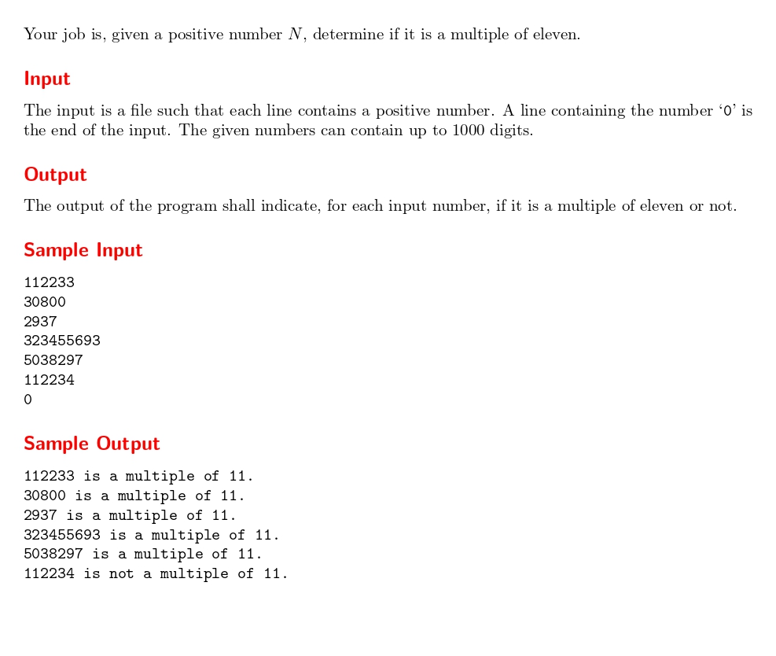

# You can say 11

題目連結:[You can say 11](https://onlinejudge.org/index.php?option=com_onlinejudge&Itemid=8&category=21&page=show_problem&problem=1870)


這題會輸入一連串的數字，然後要判斷是不是 11 的倍數。
首先要注意的是 Input 提到給的數字最大會到 1000 位數，因此我們無法用 long long int 存數字，這裡我們用 `char[1000]` 來儲存數字。

再來是 11 倍數判別法: **奇數位數相加減去偶數位數相加的絕對 mod 11 = 0** 為 11 的倍數，否則不是 11 的倍數。

我們可以宣告兩個變數 `odd_sum`, `even_sum` 儲存 奇偶位數的相加值，用迴圈累積相加

```C
int odd = 0, even = 0;
int len = strlen(num);
for(int i = len-1; i >= 0; i-=2){
    odd += (num[i]-'0');
}
for(int i = len-2; i >= 0; i-=2){
    even += (num[i]-'0');
}
```
由於無法確定陣列首位的奇偶數，所以我們是由後往前遍歷。
然後我們是用 char 儲存數字，所以要先把 char 轉成數字的格式，可以用`arr[i] - '0'` 的方式轉換。

再來用 if 判斷是否符合條件即可。

這題由於使用到 `strlen()` 與 `abs()`，需要再 include <stdlib.h> 與 <string.h>。往後隨著題目的複雜度增加，用到的函式多樣化的情況下可能會需要記更多的標頭檔，這個時候可以使用 C++ 的萬用標頭檔`#include <bits//stdc++.h>` 絕大多數情況只要用這個就能解決標頭檔的問題。

```C
#include <stdio.h>
#include <stdlib.h>
#include <string.h>

int main(){
    char num[1000];
    while(scanf("%s", num) && num[0] != '0'){
        int odd = 0, even = 0;
        int len = strlen(num);
        for(int i = len-1; i >= 0; i-=2){
            odd += (num[i]-'0');
        }
        for(int i = len-2; i >= 0; i-=2){
            even += (num[i]-'0');
        }
        
        if(abs(odd-even) % 11 == 0){
            printf("%s is a multiple of 11.\n", num);
        }
        else{
            printf("%s is not a multiple of 11.\n", num);
        }
    }
}
```

題外話補充: 由於 Python 本身支援大數運算，所以遇到這題用 Python 其實是最直覺的~~也難怪CPE不太出這題~~