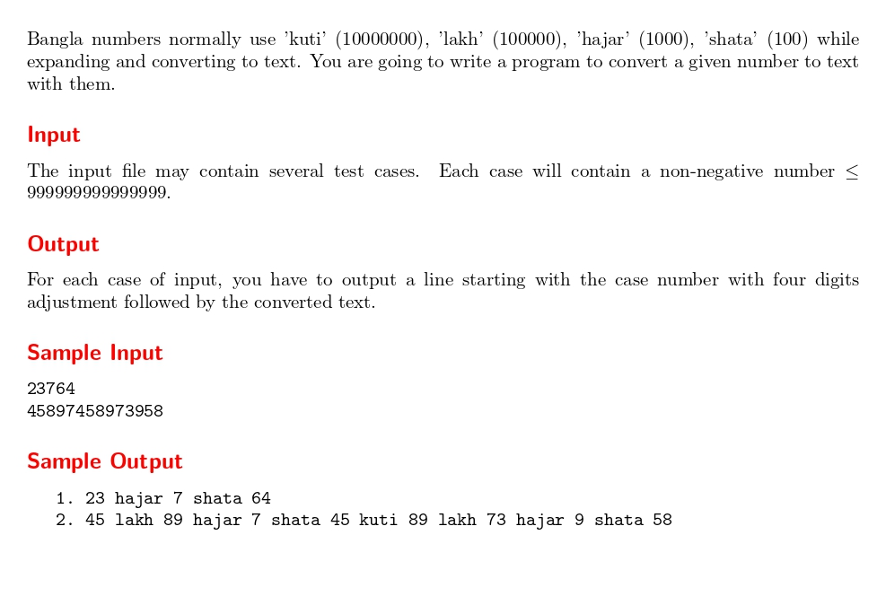

# Bangla Numbers

題目連結: [Bangla Numbers](https://onlinejudge.org/index.php?option=com_onlinejudge&Itemid=8&page=show_problem&category=13&problem=1042)


輸入一串數字，要轉成 Bangla numbers 的格式。

首先要注意的是超過 10000000 會再跳回 shata，以此類推。所以不能單純判斷 10000000 以下的數字。

這邊用的是遞迴的方式:

```C
void bangla(long long int n){
    if(n >= 10000000){
        bangla(n/10000000);
        printf(" kuti");
        n %= 10000000;
    }
    if(n >= 100000){
        bangla(n/100000);
        printf(" lakh");
        n %= 100000;
    }
    if(n >= 1000){
        bangla(n/1000);
        printf(" hajar");
        n %= 1000;
    }
    if(n >= 100){
        bangla(n/100);
        printf(" shata");
        n %= 100;
    }
    if(n >= 0){
        printf(" %lld", n);
    }
    
}
```

以測資 23764 來實際代入測試:

1. n >= 23764
2. 23764 >= 1000，回傳 bangla(23764/1000)
2.1 輸出 23
3. 輸出 "hajar"
4. 23764 %= 1000 = 764
5. 764 >= 100，回傳 bangla(764/100)
5.1 輸出 7
6. 輸出 "shata"
7. n %= 100 = 64
8. 輸出 64

最後結果為 23 hajar 7 shata 64

可以觀察到這個函式會把數字利用遞迴拆解成 bangla 的基本單位，並在找到該數字後輸出單位，直到把所有數字拆解完。

另外要注意輸出的 case 會對齊，所以要在 main 另外判斷。

```C
#include <stdio.h>

void bangla(long long int n){
    if(n >= 10000000){
        bangla(n/10000000);
        printf(" kuti");
        n %= 10000000;
    }
    if(n >= 100000){
        bangla(n/100000);
        printf(" lakh");
        n %= 100000;
    }
    if(n >= 1000){
        bangla(n/1000);
        printf(" hajar");
        n %= 1000;
    }
    if(n >= 100){
        bangla(n/100);
        printf(" shata");
        n %= 100;
    }
    if(n > 0){
        printf(" %lld", n);
    }
    
}

int main(){
    long long int n;
    int testCases = 1;
    
    while(scanf("%lld", &n) != EOF){
    	if(testCases < 10){
    		printf("   %d.", testCases);
    	}
    	else if(testCases < 100){
    		printf("  %d.", testCases);
    	}
    	else{
    		printf(" %d.", testCases);
    	}
        
        
        if(n > 0){
            bangla(n);
        }
        else{
            printf(" 0");
        }
        
        printf("\n");
        testCases++;
    }
}


```