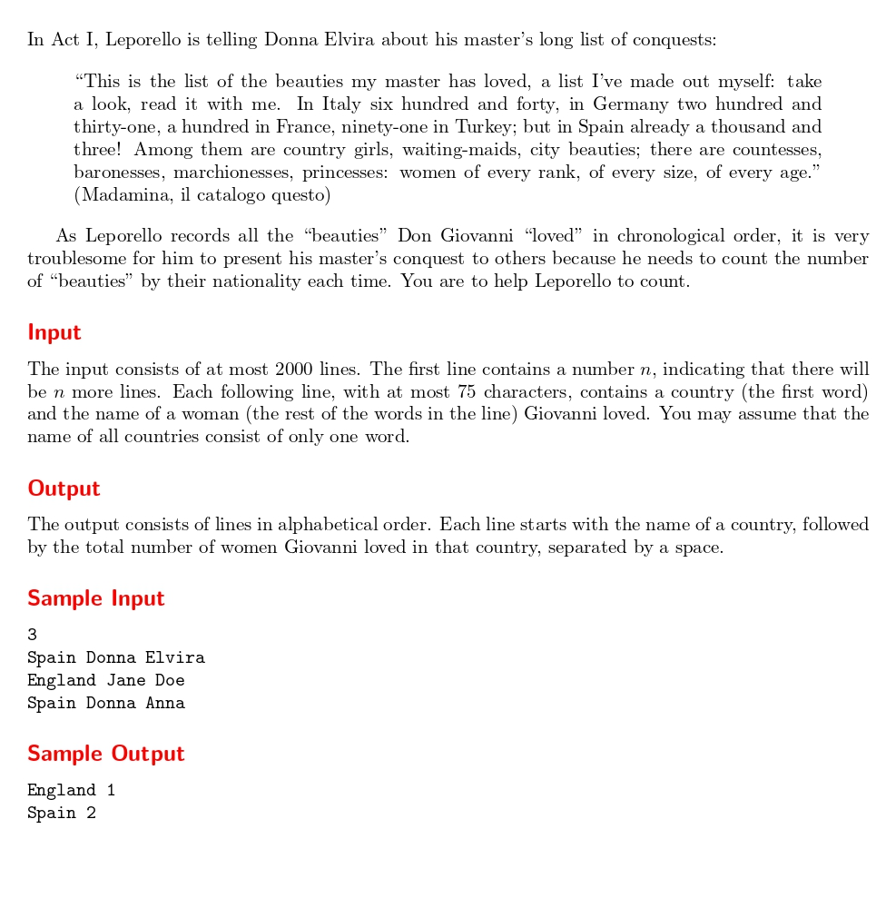

# List of Conquests

題目連結: [List of Conquests](https://onlinejudge.org/index.php?option=com_onlinejudge&Itemid=8&category=16&page=show_problem&problem=1361)


輸入測資數，後面是國家還有與題目無關的人名，要計算各個國家分別出現幾次。

這題是少數用 C++ 解的問題之一，因為題目特性適合用 C++ 來做，若用 C 會很麻煩，在考 cpe 的情況下會很不方便。

用 C++ 的一個好處是有萬用標頭檔可以用，以解題來講十分方便，只要 include 一個就可以用幾乎全部的函式，不過要注意 C++ 前面要 `using namespace std`

```Cpp
#include <bits//stdc++.h>

using namespace std;
```

再來輸入測資數與字串，這邊可以看到輸入與 C 不同，是用 `cin >> n` 的方式，這個的好處是不用特別標示輸入型別，不過 C++ 也可以用 C 的所有函式，代表也可以用 scanf()，這也是 C++ 的好處之一，可以視情況選擇輸入輸出方式，彈性很大。
再來 C++ 有新增 string 這個型別，等同於 C 的 char array，這樣就可以不用預先開陣列大小。

```cpp
int n;
    cin >> n;
    
    string country, temp_firstName, temp_lastName;
    string totalCountry[n];
    
    for(int i = 0; i < n; i++){
        cin >> country >> temp_firstName >> temp_lastName;
        totalCountry[i] = country;
    }
```

再來是 c++ 特有的 sort，跟 C 的 qsort 比起來簡化了很多，只要輸入陣列跟元素數就可以，這邊用於排序字母。
再來是計算國家出現次數並輸出。

```cpp
sort(totalCountry, totalCountry+n);
    
    int sum = 1;
    
    for(int i = 0; i < n; i++){    
        if(totalCountry[i] == totalCountry[i+1]){
            sum++;
        }
        else{
            cout << totalCountry[i] << ' ' << sum << endl;
            sum = 1;
        }
    }
```