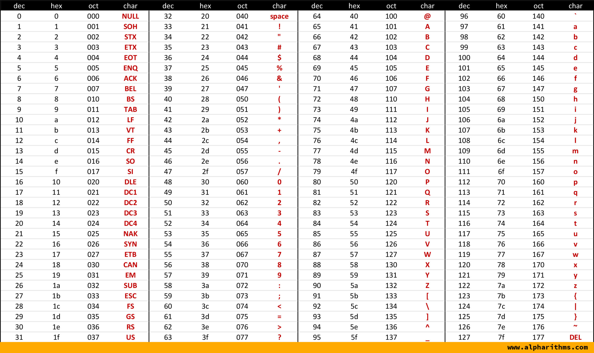

# What's Cryptanalysis

題目連結: [What's Cryptanalysis](https://onlinejudge.org/index.php?option=com_onlinejudge&Itemid=8&category=12&page=show_problem&problem=949)


題目會輸入數個字串，要去計算各個字母出現的次數並由大到小排序。

這題主要考的部分是 ASCII code 相關的轉換與計算等操作


[ASCII Table: Printable Reference & Guide](https://www.alpharithms.com/ascii-table-512119/)

首先我們透過 gets 讀取字串，並記錄長度。

```c
char s[1000];
    gets(s);
    int len=strlen(s);
```

再來是重點，我們宣告一個 ascii 的 array，長度為 ascii 的大小 127(保險起見可以開更高)，若遇到字母就把該字母位置的 ascii array +1，並把 `letter_count` +1。

```C
for(int i = 0; i < len; i++){
        if(s[i] >= 'a' && s[i] <= 'z'){
            ascii_count[s[i]-'a'+'A']++;
            letter_count++;
        }
        else{
            ascii_count[s[i]]++;
            letter_count++;
        }
    }
```
上面的`if(s[i] >= 'a' && s[i] <= 'z')` 等同於 `if(s[i] >= 97 && s[i] <= 122)`，我們可以用他 ascii 對應的數字去運算。另外輸出只看大寫字母，所以我們要對讀小寫字母的情況另外處理，換成大寫並讀入。
轉換的方法跟剛剛提到的一樣。

再來我們要輸出字母數:
```
for(int i = letter_count; i >= 1; i--){
        for(int j = 'A'; j <= 'Z'; j++){
            if(ascii_count[j]==i){
                printf("%c %d\n", j, ascii_count[j]);
            }
        }
    }
```
我們透過 `letter_count` 記錄了至少會有幾個字母，透過這個由上往下找 ascii 陣列的字母是否有符合的(只找到 1 是因為輸出只要求有出現的字母)，如果有找到就輸出該字母與出現次數。


```C
#include <stdio.h>
#include <string.h>

int main(){
    int n, letter_count = 0, ascii_count[130] = {0};
    scanf("%d", &n);
    n++;
    while(n--){
        char s[1000];
        gets(s);
        int len=strlen(s);

        for(int i = 0; i < len; i++){
            if(s[i] >= 'a' && s[i] <= 'z'){
                ascii_count[s[i]-'a'+'A']++;
                letter_count++;
            }
            else{
                ascii_count[s[i]]++;
                letter_count++;
            }
        }
    }
    
    for(int i = letter_count; i >= 1; i--){
        for(int j = 'A'; j <= 'Z'; j++){
            if(ascii_count[j]==i){
                printf("%c %d\n", j, ascii_count[j]);
            }
        }
    }
}

```