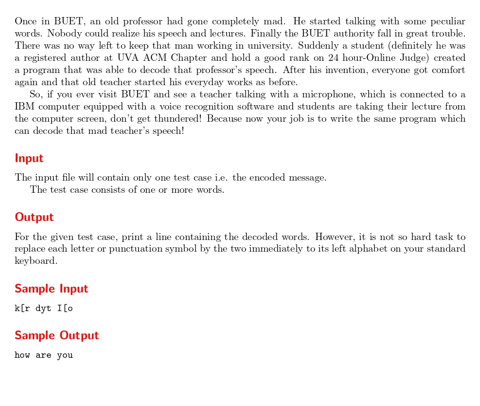

# Decode the Mad man

題目連結: [Decode the Mad man](https://onlinejudge.org/index.php?option=com_onlinejudge&Itemid=8&category=14&page=show_problem&problem=1163)


這題是要把輸入的字串轉換，轉換的方式是把字串內所有字換成該字右邊兩格的字。

例如輸入 k，輸出 k 右邊兩格的 h。

我們先建立鍵盤的 char array。

```C
char keyboard[48] = "`1234567890-=qwertyuiop[]\\asdfghjkl;'zxcvbnm,./";
```

再來將輸入的字串轉換，遇到空格照常輸出，但遇到鍵盤內的字要改成輸出鍵盤右邊兩格的字。
要注意若輸入大寫字母要轉換成小寫再用 keyboard 輸出。
```C
for(int i = 0; i < len; i++){
            if(mad_str[i] == ' '){
                    printf(" ");
                }
            for(int j = 0; j < 47; j++){
                if(mad_str[i] == keyboard[j] || mad_str[i] - 'A' + 'a' == keyboard[j]){
                    printf("%c", keyboard[j-2]);
                }
            }
        }
```

```C
#include <stdio.h>
#include <string.h>

int main(){
    char mad_str[100];
    char keyboard[48] = "`1234567890-=qwertyuiop[]\\asdfghjkl;'zxcvbnm,./";
    while(gets(mad_str) != NULL){
        int len = strlen(mad_str);
        
        for(int i = 0; i < len; i++){
            if(mad_str[i] == ' '){
                    printf(" ");
                }
            for(int j = 0; j < 47; j++){
                if(mad_str[i] == keyboard[j] || mad_str[i] - 'A' + 'a' == keyboard[j]){
                    printf("%c", keyboard[j-2]);
                }
            }
        }
        printf("\n");
    }
}
```