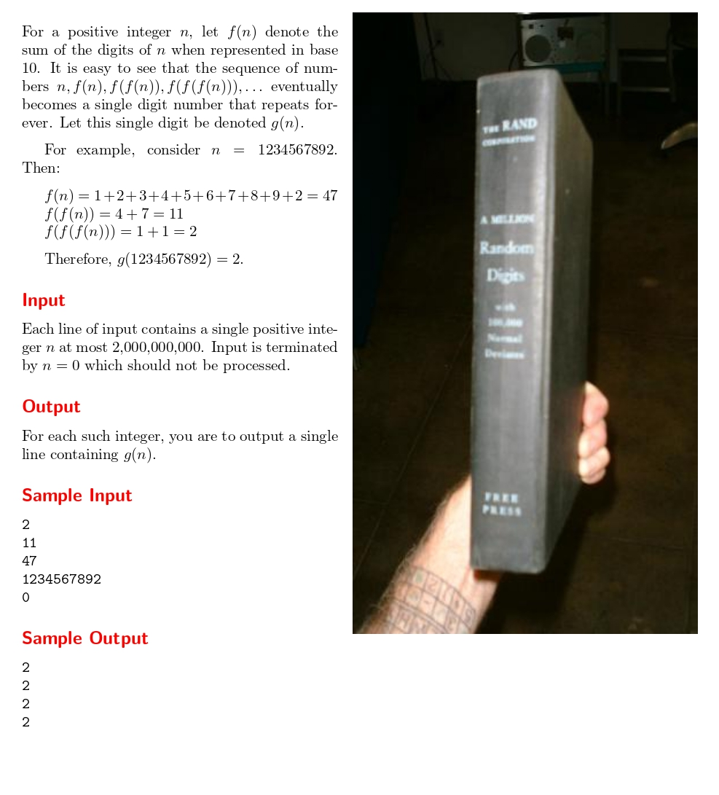

# Summing Digits

題目連結:[Summing Digits](https://onlinejudge.org/index.php?option=com_onlinejudge&Itemid=8&page=show_problem&problem=2307)


這題輸入數字 n，然後重複執行 f(n) 直到該數 < 10。
f(n): 將 n 的每一位數相加，例如 n = 123456, f(n) = 1+2+3+4+5+6=21, f(f(n)) = 2+1=3。

可以發現 f(f(n)) 很像遞迴的方式，在數字小於 10 之前一直執行 f(n)。

我們可以先從寫 f(n) 函式下手。

```C
int summing_digits(int n){
    int sum = 0;
    
    while(n != 0){
        sum += n%10;
        n /= 10;
    }
    
    if(sum >= 10){
        return summing_digits(sum);
    }
    else{
        return sum;
    }
}
```

在 main 只要將輸入的 n 丟到 `summing_digits` 即可。

```C
#include <stdio.h>

int summing_digits(int n){
    int sum = 0;
    
    while(n != 0){
        sum += n%10;
        n /= 10;
    }
    
    if(sum >= 10){
        return summing_digits(sum);
    }
    else{
        return sum;
    }
}

int main(){
    int n;
    while(scanf("%d", &n) && n != 0){
        printf("%d\n", summing_digits(n));
    }
}
```