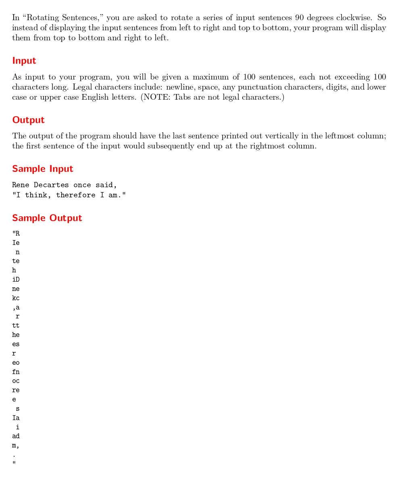

# Rotating Sentences

題目連結:[Rotating Sentences](https://onlinejudge.org/index.php?option=com_onlinejudge&Itemid=8&category=6&page=show_problem&problem=431)


這題會輸入數個句子，然後要把整著句子順時針翻轉 90 度後輸出。

首先以二維陣列的方式輸入，再紀錄最長的句子的長度。

```C
while(gets(str[row]) != NULL){
        if(max_col < strlen(str[row])){
            max_col = strlen(str[row]);
        }
        row++;
    }
```

再來用我們紀錄的 `max_col` 當邊界反轉矩陣輸出，這邊要記得若是句子小於最長句子要補空白。

```C
for(int i = 0; i < max_col; i++){
        for(int j = row-1; j >= 0; j--){
            if(i < strlen(str[j])){
                printf("%c", str[j][i]);
            }
            else{
                printf(" ");
            }
            
        }
        printf("\n");
    }
```

```C
#include <stdio.h>
#include <string.h>

int main(){
    char str[101][101];
    int row = 0, max_col = 0;
    while(gets(str[row]) != NULL){
        if(max_col < strlen(str[row])){
            max_col = strlen(str[row]);
        }
        row++;
    }
    
    for(int i = 0; i < max_col; i++){
        for(int j = row-1; j >= 0; j--){
            if(i < strlen(str[j])){
                printf("%c", str[j][i]);
            }
            else{
                printf(" ");
            }
            
        }
        printf("\n");
    }
}
```