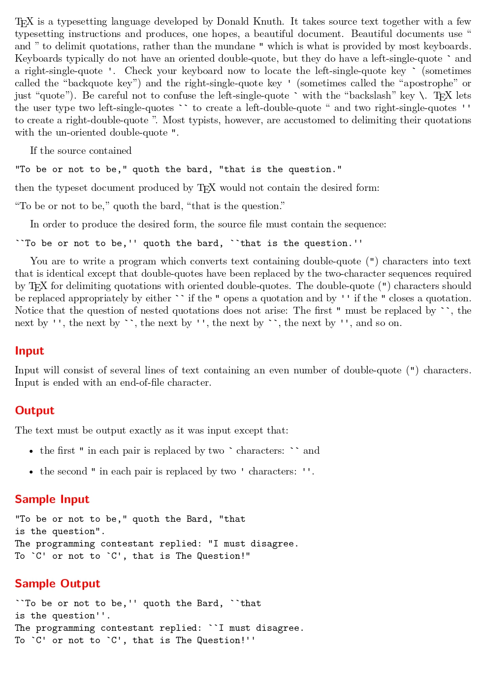

# TeX Quotes

題目連結:[TeX Quotes](https://onlinejudge.org/index.php?option=com_onlinejudge&Itemid=8&category=24&page=show_problem&problem=208)


這題的概念也很單純，把前面的雙引號更換成``` `` ```，後面的更換成 '' 即可。

由於輸入是句子，我們可以用 `gets` 輸入。
`while(gets(s) != NULL)`
==雖然在 C 有更安全的 `fgets` 可以使用，但在解題上 `gets` 就已足夠。==

再來是重新輸出句子，這邊我們會用 flag 判斷雙引號的前後，用 flag 為 0 或 1 來判斷前後雙引號。

```C
#include <stdio.h>

int main(){
    char s[1000];
    int len, flag = 0;
    while(gets(s) != NULL){
        len = strlen(s);
        for(int i = 0; i < len; i++){
            if(s[i] == '"' && flag == 0){
                printf("``");
                flag = 1;
            }
            else if(s[i] == '"' && flag == 1){
                printf("''");
                flag = 0;
            }
            else{
                printf("%c", s[i]);
            }
        }
        printf("\n");
    }

    return 0;
}
```
