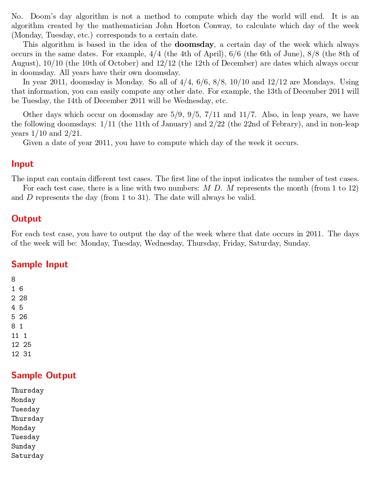

# Doom’s Day Algorithm

題目連結: (Doom’s Day Algorithm)[https://onlinejudge.org/index.php?option=com_onlinejudge&Itemid=8&category=242&page=show_problem&problem=3170]


**doomsday** 的定義是在特定日期的 n 月 n 日的星期數相同。例如在  2011 年 4/4 6/6 8/8 10/10 12/12 都是星期一。

我們可以透過這個反推某一年份的指定日期是星期幾，題目問的就是給 2021 年的日期，求出是在星期幾。

可以從 sample input/output 看出 1/6 是星期四，反推 1/1 是星期六。
以 1/1 號為基底，只要知道輸入的日期是在 2021 年的第幾天，我們就可以推出它是星期幾。

首先先用 array 紀錄月份英文與月份天數的 map

```C
int day_map[12] = {31, 28, 31, 30, 31, 30, 31, 31, 30, 31, 30, 31};
char month_map[7][10] = {"Friday", "Saturday", "Sunday", "Monday", "Tuesday", "Wednesday", "Thursday"}; 
```

再來宣告 `total_day = d`，再用 for 把前面的月份對應的天數加進來，計算出總天數，最後再把總天數 mod 7 就可以得出答案。

```C
int m, d;
        scanf("%d%d", &m, &d);
        
        int total_day = d;
        
        for(int i = 0; i < m-1; i++){
            total_day += day_map[i];
        }
        
        printf("%s\n", month_map[total_day%7]);
```

```C
#include <stdio.h>

int main(){
    int day_map[12] = {31, 28, 31, 30, 31, 30, 31, 31, 30, 31, 30, 31};
    char month_map[7][10] = {"Friday", "Saturday", "Sunday", "Monday", "Tuesday", "Wednesday", "Thursday"}; 
    int t;
    scanf("%d", &t);
    while(t--){
        int m, d;
        scanf("%d%d", &m, &d);
        
        int total_day = d;
        
        for(int i = 0; i < m-1; i++){
            total_day += day_map[i];
        }
        
        printf("%s\n", month_map[total_day%7]);
    }
}
```