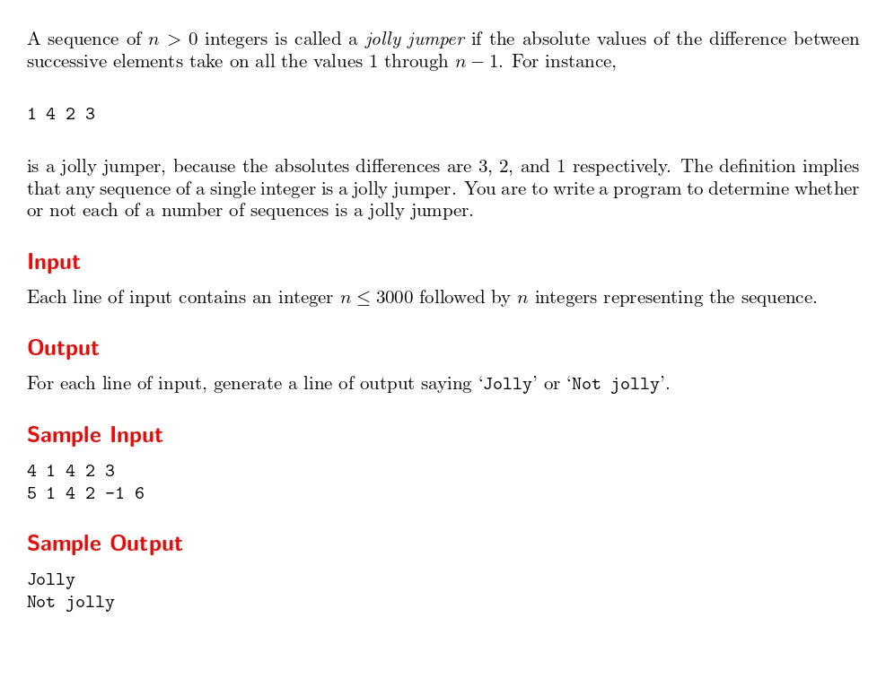

# Jolly Jumpers

題目連結: (Jolly Jumpers)[https://onlinejudge.org/index.php?option=com_onlinejudge&Itemid=8&page=show_problem&problem=979]


這題也是檢驗數列的題目，Jolly Jumpers 的定義是相鄰的2個數其差的絕對值恰好為 1 到 n-1，
例如 1 3 6 5 結果為 2 3 1 ，1~n-1 的數字都有就算。

我們可以宣告兩個陣列。一個放題目的數列，另一個放相鄰兩數的差是否符合定義。

透過 `memset` 將陣列清空，再逐項絕對值相減看是否 >= 1 且 < n ，再走訪陣列看是不是都 1 來判斷。

```C
#include <stdio.h>
#include <stdlib.h>
#include <cstring>

int main(){
    int n;
    while(scanf("%d", &n) != EOF){
        int numberArray[n];
        int diffFound[n];
        memset(diffFound, 0, sizeof(diffFound));

        for(int i = 0; i < n; i++){
            scanf("%d", &numberArray[i]);
        }

        for(int i = 0; i < n - 1; i++){
            int diff = abs(numberArray[i] - numberArray[i + 1]);
            if(diff >= 1 && diff < n){
                diffFound[diff] = 1;
            }
        }

        int isJolly = 1;
        for(int i = 1; i < n; i++){
            if(!diffFound[i]){
                isJolly = 0;
                break;
            }
        }
        if(isJolly){
            printf("Jolly\n");
        }
        else{
            printf("Not jolly\n");
        }
    }   
}

```