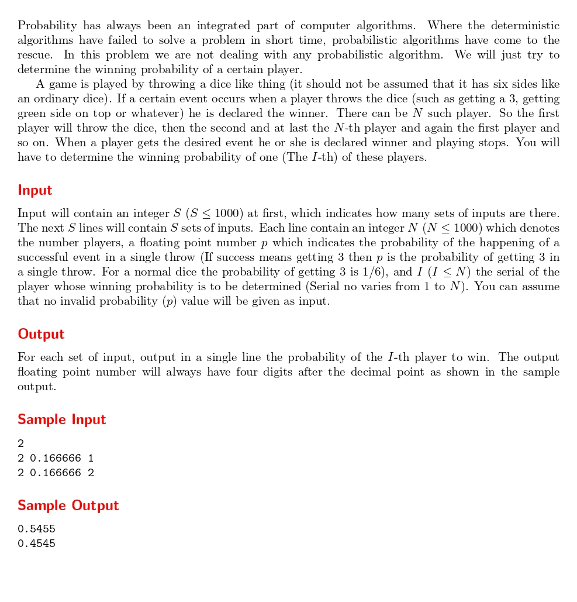

# What is the Probability ?

題目連結: (What is the Probability ?)[https://onlinejudge.org/index.php?option=com_onlinejudge&Itemid=8&category=12&page=show_problem&problem=997]


題目輸入N個玩家與成功事件發生的機率，要指定特定玩家獲勝的機率。

這題是套公式的數學題。先定義 q 為失敗的機率(1-p):
這是總獲勝機率
$P = p * q^{I-1} * (1 + q^N + q^2N + q^3N + ...)$
這是等比級數，用求和公式可得
$p * q^{I-1} * (1 / (1 - q^N))$

~~不過若是以 cpe 過關為目標可以直接硬記公式比較快~~
```C
#include <stdio.h>
#include <math.h>

int main(){
    int s;
    scanf("%d", &s);
    while(s--){
        int n, i;
        double p;
        scanf("%d %lf %d", &n, &p, &i);
        if(p == 0){
            printf("0.0000\n");
            continue;
        }
        double q = 1-p;
        printf("%.4f\n", pow(q, (i-1))*p / (1-pow(q, n)));
    }
}
```

