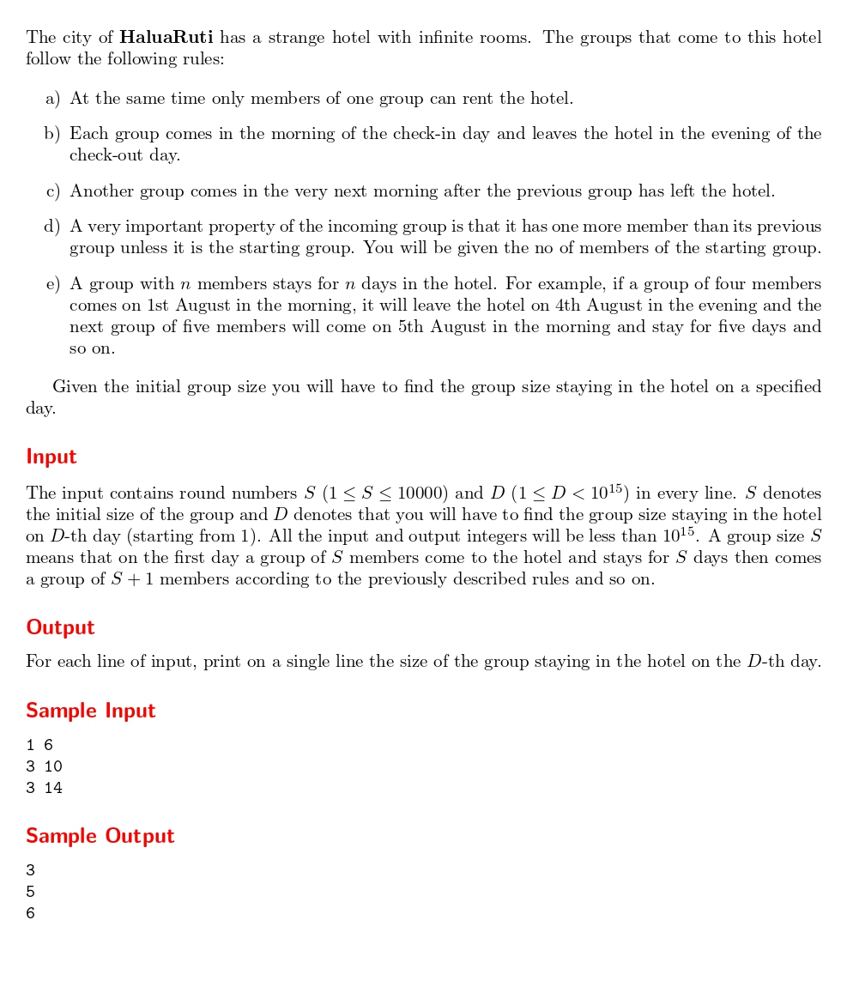

# The Hotel with Infinite Rooms

題目連結:(The Hotel with Infinite Rooms)[https://onlinejudge.org/index.php?option=com_onlinejudge&Itemid=8&page=show_problem&problem=1111]


有一間旅館有無限的房間，他們有以下規定:
1. 一次只有一個旅行團能住。
2. 旅行團內有幾個人該團就待幾天(例如 5 人的旅行團待 5 天)。
3. 後面入住的旅行團會比前一個旅行團多 1 人。

現在會輸入第一組旅行團 S 跟天數 D，要回傳過 D 天後入住的旅行團人數。

我們可以用 for loop 去找

```C
int member = s;
        for(int i = s; s < d; s += member){
            if(s >= d){
                break;
            }
            else{
                member++;
            }
        }
```
設初值為 s，在小於指定天數前持續增加後續入住的旅行團人數 member。
如果人數大於指定天數跳出迴圈，否則持續增加 member。

```C
#include <stdio.h>

int main(){
    int s, d;
    while(scanf("%d%d", &s, &d) != EOF){
        int member = s;
        for(int i = s; s < d; s += member){
            if(s >= d){
                break;
            }
            else{
                member++;
            }
        }
        
        printf("%d\n", member);
    }
```