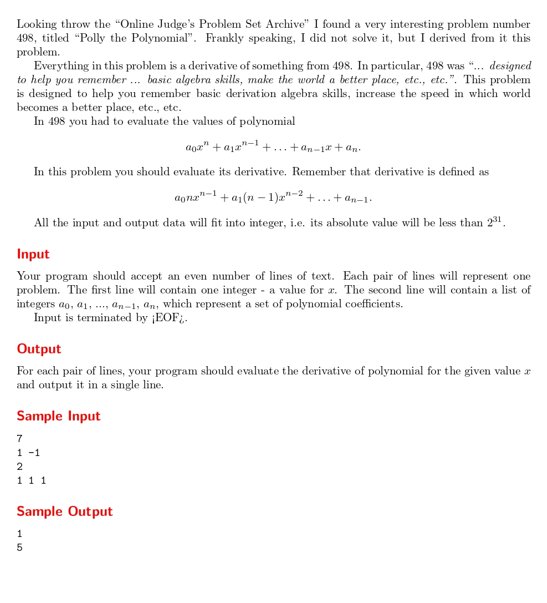

# 498-bis

題目連結:(498-bis)[https://onlinejudge.org/index.php?option=onlinejudge&Itemid=8&page=show_problem&problem=1209]


給 x 值與降冪的方程式，求微分後代入 x 的值。

這題最麻煩的是輸入方程式，因為題目沒給有幾項 x。
我們可以用 `getchar()` 來讀數字的下一格，若讀到換行符號代表讀完。

```C
while (1) {
            scanf("%d", &a[n]);
            char ch = getchar();
            n++;
            if (ch == '\n') break;
        }
```

再來處理微分，從最小的項一路累加到最大的項，並把答案回傳。

```C
int derivative(int x, int max) {
    long long sum = 0;
    int e = 1;

    for (int i = max - 2; i >= 0; i--) {
        sum += a[i] * (max - i - 1) * e;
        e *= x;
    }

    return sum;
}
```

```C
#include <stdio.h>

int a[1000000];

int derivative(int x, int max) {
    long long sum = 0;
    int e = 1;

    for (int i = max - 2; i >= 0; i--) {
        sum += a[i] * (max - i - 1) * e;
        e *= x;
    }

    return sum;
}

int main() {
    int x;

    while (scanf("%d", &x) != EOF) {
        int n = 0;
        while (1) {
            scanf("%d", &a[n]);
            char ch = getchar();
            n++;
            if (ch == '\n') break;
        }

        printf("%d\n", derivative(x, n));
    }

    return 0;
}

```