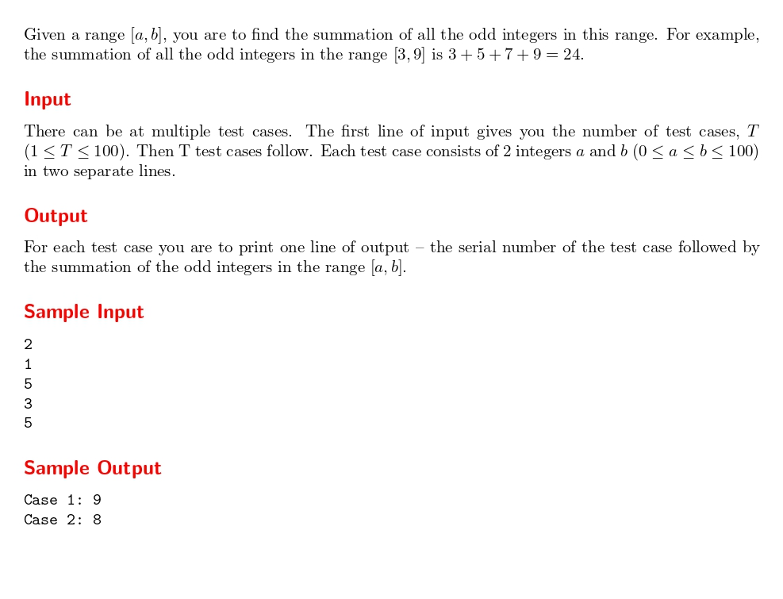

# Odd Sum

題目連結:(Odd Sum)[https://onlinejudge.org/index.php?option=com_onlinejudge&Itemid=8&category=24&page=show_problem&problem=1724]


輸入兩個數字 a, b，問在這個範圍內的所有奇數的和。
只要用迴圈設定 a 到 b 之間，再把數字加起來即可。若 a 為偶數將 a+1，確保迴圈的起始是從奇數開始。

```C
#include <stdio.h>

int main(){
    int t;
    scanf("%d", &t);
    for(int i = 1; i <= t; i++){
        int a, b, sum = 0;
        scanf("%d", &a);
        scanf("%d", &b);
        
        if(a % 2 == 0){
            a++;
        }
        for(int j = a; j <= b; j+=2){
            sum += j;
        }
        
        printf("Case %d: %d\n", i, sum);
    }

}
```