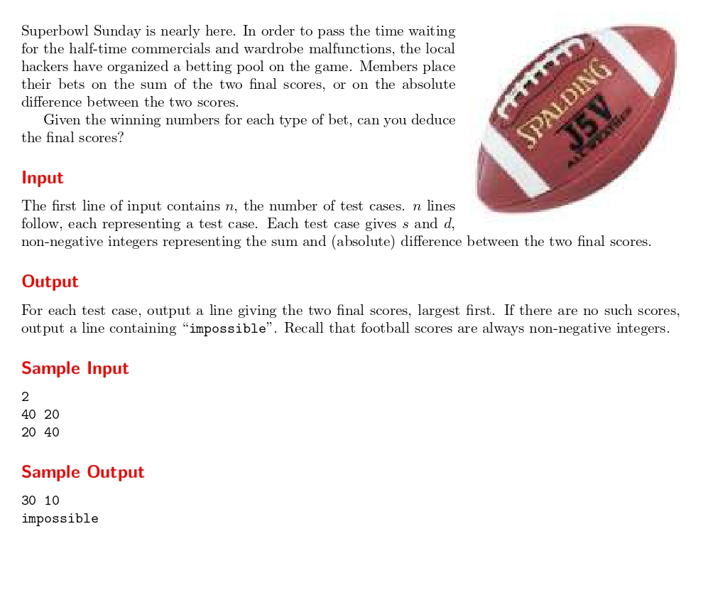

# Beat the Spread!

題目連結:(Beat the Spread!)[https://onlinejudge.org/index.php?option=com_onlinejudge&Itemid=8&category=24&page=show_problem&problem=1753]



題目輸入的是兩隊分數的和與差，要求這兩隊各自的分數，若不可能則輸出 "Impossible"
我們可以假設 A 隊 跟 B 隊，而各自比分為 a, b。
則題目輸入的是 a+b, a-b，代表我們只要求這個聯立方程式的解就可以得出答案，而在兩個情況下會輸出 "Impossible"

* 求出來的 a, b 有一方是負數, 例如輸入 20, 40，a = 30, b = -10。
* 求出來的 a, b 有一方非整數(無法整除), 例如輸入 100, 1，a = 50.5, b = 49.5。

```C
#include <stdio.h>

int main(){
    int t;
    scanf("%d", &t);
    
    while(t--){
        int s, d;
        scanf("%d%d", &s, &d);
        int a = (s+d)/2;
        int b = s-a;
        
        if(s < d || (s+d) % 2 != 0){
            printf("impossible\n");
        }
        else{
            printf("%d %d\n", a, b);
        }
    }
}

```