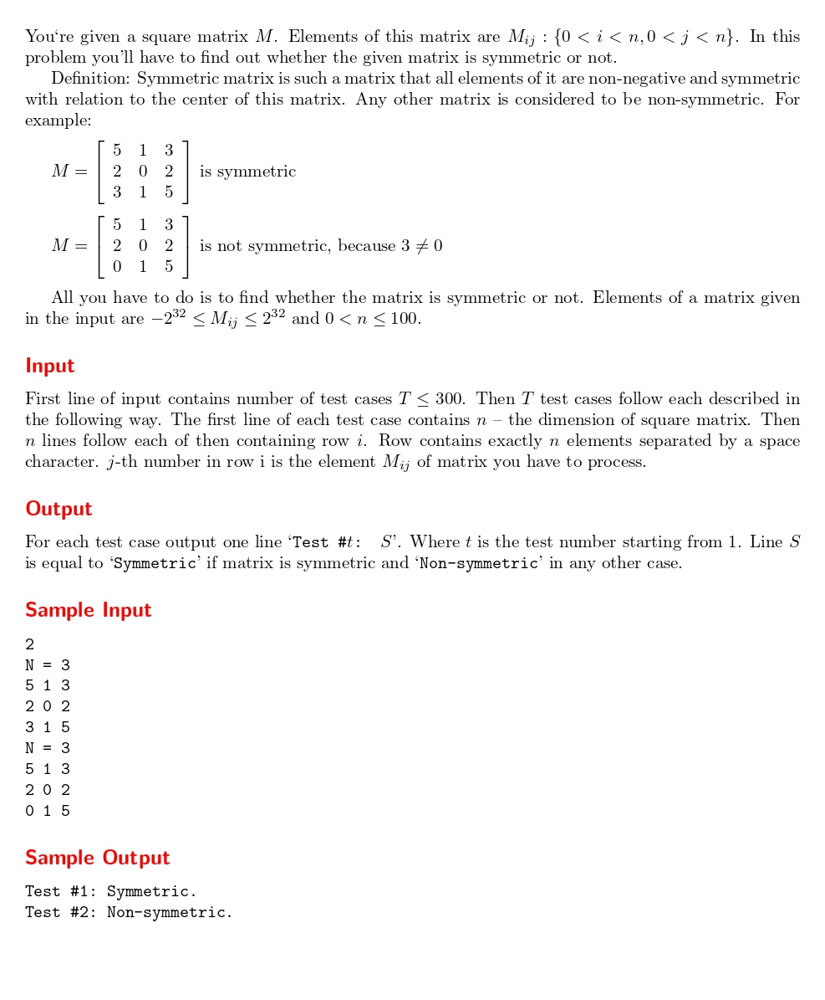

# Symmetric Matrix

題目連結:(Symmetric Matrix)[https://onlinejudge.org/index.php?option=com_onlinejudge&Itemid=8&category=24&page=show_problem&problem=2324]


題目會輸入矩陣維度跟矩陣，要判斷這是否是對稱矩陣。

這題在輸入矩陣維度的時候是最麻煩的，因為他不是直接給維度而是`N = 3`，而我們只需要 3 這個數字。

我們可以透過讀取 char 來把我們不需要的 N 跟 = 讀入，避免格式跑掉前面要空行。
```C
char tempN, tempE;
    scanf(" %c", &tempN);
    scanf(" %c", &tempE);
    scanf(" %d", &n);
```

再來是輸入矩陣，題目有提到對稱矩陣是非負的，所以讀到負數要判斷不是對稱矩陣。

```C
int matrix[n][n];
        int isSym = 1;
        
        for (int i = 0; i < n; i++) {
            for (int j = 0; j < n; j++) {
                scanf("%d", &matrix[i][j]);
                if (matrix[i][j] < 0) {
                    isSym = 0;
                }
            }
        }
```

然後用兩層的迴圈判斷矩陣對應的數字是否相同，若不同代表不是對稱矩陣。
```C
if (isSym) {
            for (int i = 0; i < n && isSym; i++) {
                for (int j = 0; j < n; j++) {
                    if (matrix[i][j] != matrix[n-1-i][n-1-j]) {
                        isSym = 0;
                        break;
                    }
                }
            }
        }
```

```C
#include <stdio.h>

int main(){
    int t;
    scanf("%d", &t);
    for(int i = 1; i <= t; i++){
        int n;
        char tempN, tempE;
        scanf(" %c", &tempN);
        scanf(" %c", &tempE);
        scanf(" %d", &n);
        
        int matrix[n][n];
        int isSym = 1;
        
        for (int i = 0; i < n; i++) {
            for (int j = 0; j < n; j++) {
                scanf("%d", &matrix[i][j]);
                if (matrix[i][j] < 0) {
                    isSym = 0;
                }
            }
        }
        
        if (isSym) {
            for (int i = 0; i < n && isSym; i++) {
                for (int j = 0; j < n; j++) {
                    if (matrix[i][j] != matrix[n-1-i][n-1-j]) {
                        isSym = 0;
                        break;
                    }
                }
            }
        }
        
        if(isSym){
            printf("Test #%d: Symmetric.\n", i);
        }
        else{
            printf("Test #%d: Non-symmetric.\n", i);
        }
    }

}

```