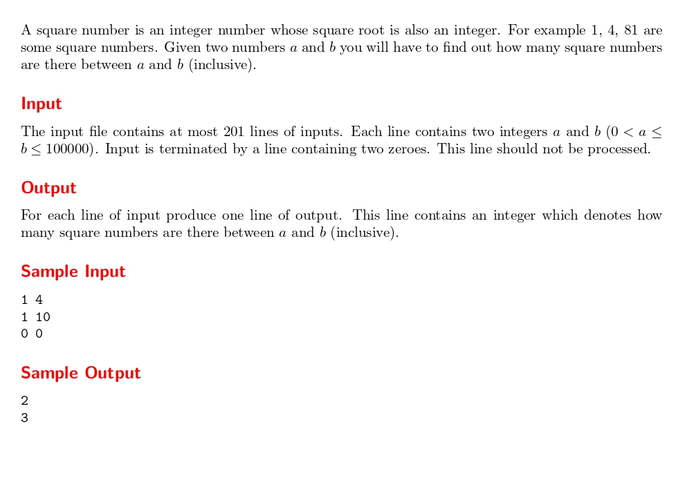

# Square Numbers

題目連結:(Square Numbers)[https://onlinejudge.org/index.php?option=com_onlinejudge&Itemid=8&category=24&page=show_problem&problem=2456]


輸入兩個數字 a, b，問在這個範圍內的平方數有幾個。

平方數是可以寫成某個整數的平方的數，即其平方根為整數的數。例如 9 = 3*3。

以輸入測資為例， 1 到 4 中 1 和 4 根號後也是整數，所以輸出 2。
要知道 0 到 某數的平方數有幾個只要把某數開根號即可。
所以計算 sqrt(b)-sqrt(a-1) 就是答案(a-1的原因是避免重複算到a)

```C
#include <stdio.h>
#include <math.h>

int main(){

    int a, b;
    
    while(1){
        scanf("%d%d", &a, &b);
        if(a==0 && b == 0){
            break;
        }
        int square_maxNumber = sqrt(b), square_minNumber = sqrt(a - 1);
        printf("%d\n", square_maxNumber - square_minNumber);
    }
}
```

