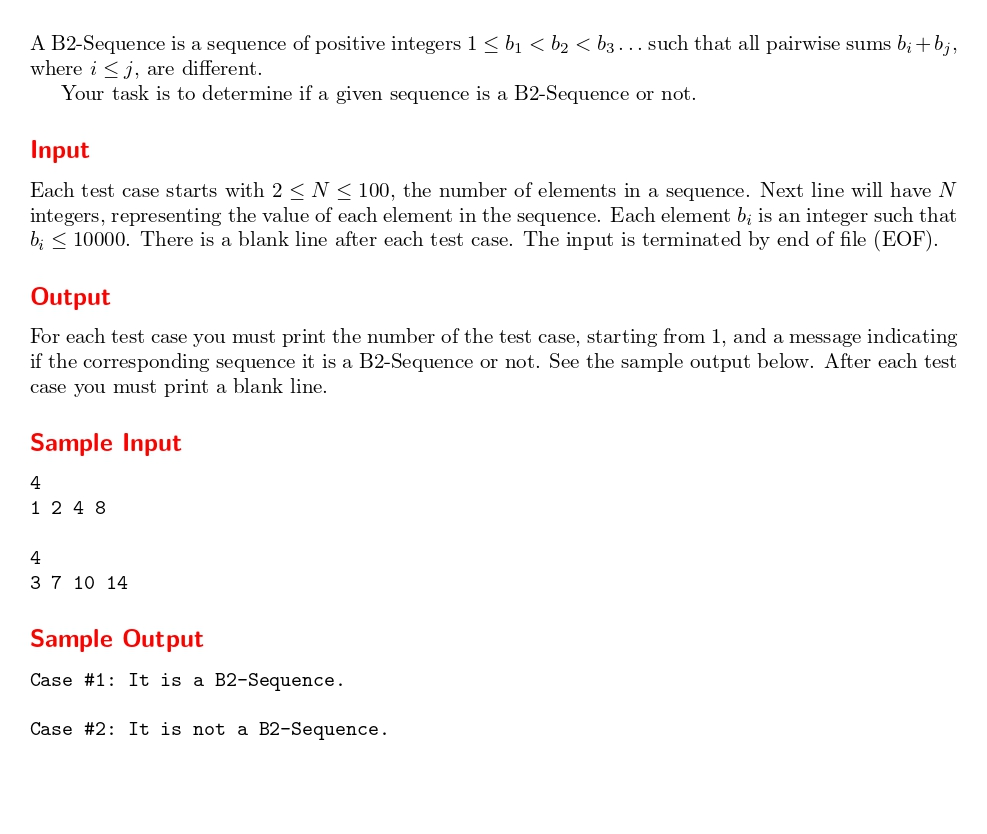

# B2-Sequence

題目連結:(B2-Sequence)[https://onlinejudge.org/index.php?option=com_onlinejudge&Itemid=8&category=24&page=show_problem&problem=2004]


這題是判斷一數列是否為 B2數列，規則如下:

1. 首項 >= 1
2. 數字由小到大
3. 數項內任取兩數相加值都不同


我們先讀入該行有幾個數字，再把數字放到陣列，用 bool 的方式判斷是否符合 B2 定義。

```C
while (scanf("%d", &n) != EOF) {
        int arr[100];
        int b2[10000];
        int index = 0;
        int isb2 = 1;

        for (int i = 0; i < n; i++) {
            scanf("%d", &arr[i]);
        }
```

檢查第一跟第二條規則
```C
for (int i = 0; i < n; i++) {
            if (arr[i] <= 0 || (i > 0 && arr[i] <= arr[i - 1])) {
                isb2 = 0;
            }
        }
```

再來我們透過兩層的陣列把所有相加組合放到另一個陣列，再走訪該陣列檢查是否有相同的值。

```C
        for (int i = 0; i < n && isb2; i++) {
            for (int j = i; j < n; j++) {
                b2[index++] = arr[i] + arr[j];
            }
        }

        for (int i = 0; i < index && isb2; i++) {
            for (int j = i + 1; j < index; j++) {
                if (b2[i] == b2[j]) {
                    isb2 = 0;
                    break;
                }
            }
        }
```

最後根據`isb2`的結果輸出即可。

```C
if (isb2) {
            printf("Case #%d: It is a B2-Sequence.\n\n", b2case);
        } else {
            printf("Case #%d: It is not a B2-Sequence.\n\n", b2case);
        }
```

```C
#include <stdio.h>

int main() {
    int n;
    int b2case = 1;

    while (scanf("%d", &n) != EOF) {
        int arr[100];
        int b2[10000];
        int index = 0;
        int isb2 = 1;

        for (int i = 0; i < n; i++) {
            scanf("%d", &arr[i]);
        }

        for (int i = 0; i < n; i++) {
            if (arr[i] <= 0 || (i > 0 && arr[i] <= arr[i - 1])) {
                isb2 = 0;
            }
        }

        for (int i = 0; i < n && isb2; i++) {
            for (int j = i; j < n; j++) {
                b2[index++] = arr[i] + arr[j];
            }
        }

        for (int i = 0; i < index && isb2; i++) {
            for (int j = i + 1; j < index; j++) {
                if (b2[i] == b2[j]) {
                    isb2 = 0;
                    break;
                }
            }
        }

        if (isb2) {
            printf("Case #%d: It is a B2-Sequence.\n\n", b2case);
        } else {
            printf("Case #%d: It is not a B2-Sequence.\n\n", b2case);
        }

        b2case++;
    }

    return 0;
}

```