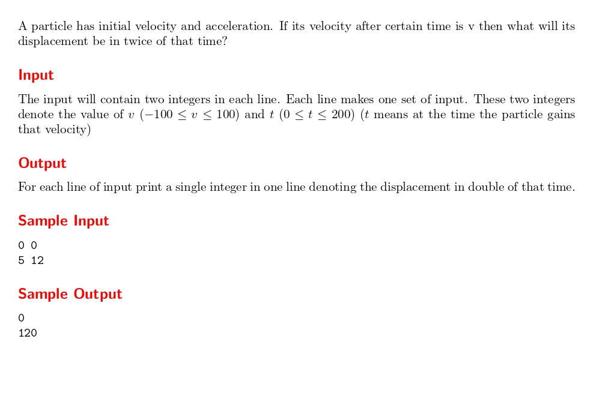

# Back to High School Physics

題目連結:[Back to High School Physics](https://onlinejudge.org/index.php?option=com_onlinejudge&Itemid=8&category=24&page=show_problem&problem=1012)


給 v 跟 t，求 2t 後的位移。
在 vt 圖，位移為 vt 圖的面積，因此只要計算 2vt 的值即可。

```C
#include <stdio.h>

int main(){
    int v, t;
    while(scanf("%d%d", &v, &t) != EOF){
        printf("%d\n", 2*v*t);
    }
}
```