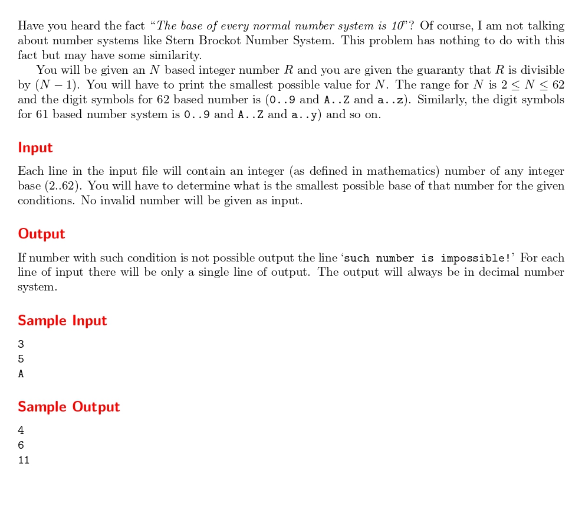

# An Easy Problem!

題目連結:[An Easy Problem!](https://onlinejudge.org/index.php?option=com_onlinejudge&Itemid=8&category=24&page=show_problem&problem=1034)


題目會給數字，但可能給的範圍是2~62位數N(代表要用 char 存)，然後要找出最小的N，保證R可以被N-1整除。

62位數的表示為0~9,A~Z,a~z，其他位數以此類推。

首先一個一個讀字串，轉換成10進位的表示法，並把每個位數加總，找出數字中最大的 base。
```C
int currentNumber = 0, maxNumber = 0;
        int base = 1;
        for(int i = 0; i < strlen(n); i++){
            if(n[i] >= '0' && n[i] <= '9'){
                currentNumber = n[i] - '0';
            }
            else if(n[i] >= 'A' && n[i] <= 'Z'){
                currentNumber = (n[i] - 'A' + 10);
            }
            else if(n[i] >= 'a' && n[i] <= 'z'){
                currentNumber = (n[i] - 'a' + 36);
            }
            else{
                continue;
            }
            maxNumber += currentNumber;
            if(base < currentNumber){
                base = currentNumber;
            } 
```
再從剛剛找到的最大 base 開始往上找，若找到符合定義的輸出。
```C
        for(; base < 62; base++){
            if((maxNumber % base) == 0){
                printf("%d\n", base+1);
                break;
            }
        }
        
        if(base == 62){
            printf("such number is impossible!\n");
        }
```

```C
#include <stdio.h>
#include <string.h>

int main(){
    char n[63]; 
    while(gets(n) != NULL){
        int currentNumber = 0, maxNumber = 0;
        int base = 1;
        for(int i = 0; i < strlen(n); i++){
            if(n[i] >= '0' && n[i] <= '9'){
                currentNumber = n[i] - '0';
            }
            else if(n[i] >= 'A' && n[i] <= 'Z'){
                currentNumber = (n[i] - 'A' + 10);
            }
            else if(n[i] >= 'a' && n[i] <= 'z'){
                currentNumber = (n[i] - 'a' + 36);
            }
            else{
                continue;
            }
            maxNumber += currentNumber;
            if(base < currentNumber){
                base = currentNumber;
            } 
        }
        for(; base < 62; base++){
            if((maxNumber % base) == 0){
                printf("%d\n", base+1);
                break;
            }
        }
        
        if(base == 62){
            printf("such number is impossible!\n");
        }
    }
}
```