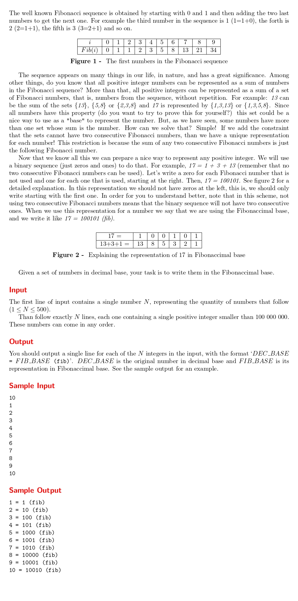

# Fibonaccimal Base

題目連結:[Fibonaccimal Base](https://onlinejudge.org/index.php?option=com_onlinejudge&Itemid=8&category=24&page=show_problem&problem=889)


每個數字都可以拆成費氏數列的數字相加，例如 17 = 1 + 3 + 13，參考題目圖表，題目要求的就是輸出該數用了什麼費氏數列內的數字相加而成，有用的輸出1，沒有的輸出0。

我們可以先從建一個費氏數列開始:

```C
    int fib[45];
    fib[0] = 0, fib[1] = 1, fib[2] = 1;
    
    for(int i = 3; i <= 45; i++){
        fib[i] = fib[i-1] + fib[i-2];
    }
```
根據定義，首項跟第二項為1，後面項的定義為其前面兩項相加。我們可以用這個特性得出費氏數列(這方法稱為dynamic programming)

再來從我們建好的費氏數列由大到小去找比輸入數字小的值並相減，找到後開始輸出費氏進位(把 flag 設成1)。
```C
for(int i = 45; i > 1; i--){
            if(num >= fib[i]){
                printf("1");
                num -= fib[i];
                flag = 1;
            }
            else if(num < fib[i] && flag == 1){
                printf("0");
            }
        }
        printf(" (fib)\n");
```
用 flag 是因為輸出是從費氏數列遇到第一個比輸入數字小的開始。

```C
#include <stdio.h>

int main(){
    int fib[45];
    fib[0] = 0, fib[1] = 1, fib[2] = 1;
    
    for(int i = 3; i <= 45; i++){
        fib[i] = fib[i-1] + fib[i-2];
    }
    
    int n;
    scanf("%d", &n);
    
    while(n--){
        int num, flag = 0;
        scanf("%d", &num);
        printf("%d = ", num);
        
        for(int i = 45; i > 1; i--){
            if(num >= fib[i]){
                printf("1");
                num -= fib[i];
                flag = 1;
            }
            else if(num < fib[i] && flag == 1){
                printf("0");
            }
        }
        printf(" (fib)\n");
    }
}
```