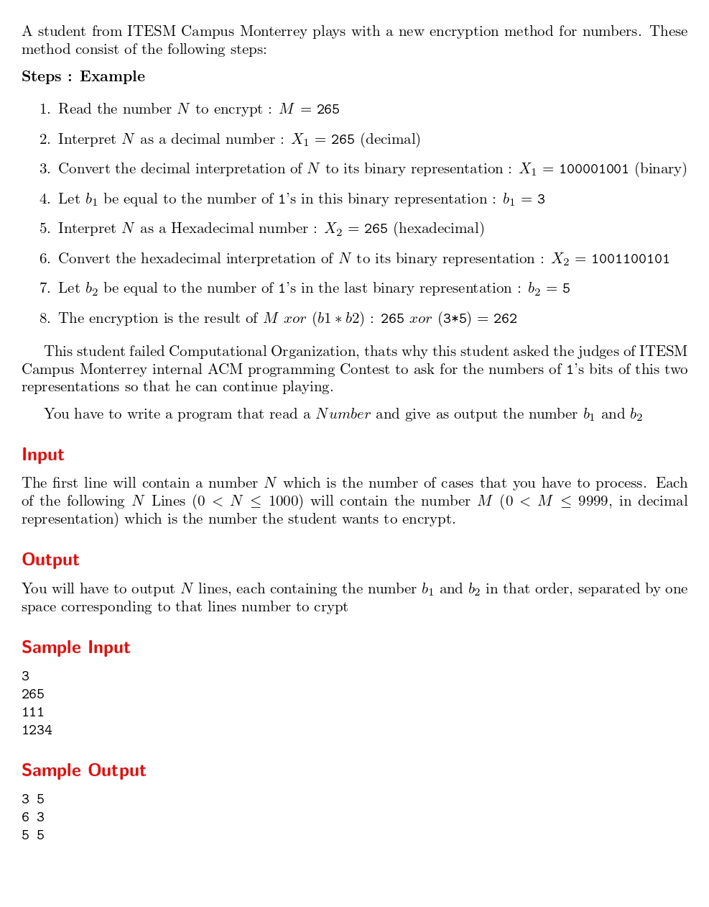

# Funny Encryption Method

題目連結:[Funny Encryption Method](https://onlinejudge.org/index.php?option=com_onlinejudge&Itemid=8&category=24&page=show_problem&problem=960S)


這題要我們把輸入的數字加密，加密的形式有兩種

1. 轉成二進制(binary)，再計算有幾個1
2. 轉成十六進制(hexadecimal)再轉成二進制看有幾個1

我們可以用除法的方式計算二進制有幾個1

```C
int binaryCount(int m){
    int onesCount = 0;
    while(m != 0){
        if(m % 2 == 1){
            onesCount++;
        }
        m /= 2;
    }
    return onesCount;
}
```

十六進制的部分可以用十六進制轉十進制的方法，將位數以十六的次方相加。
```C
int decToHex(int m){
    int hex = 0, index = 0;
    while(m != 0){
        hex += pow(16, index) * (m%10);
        m /= 10;
        index++;
    }
    return hex;
}
```
再把`decToHex` 套到 `binaryCount` 即可。

```C
#include <stdio.h>
#include <math.h>

int decToHex(int m){
    int hex = 0, index = 0;
    while(m != 0){
        hex += pow(16, index) * (m%10);
        m /= 10;
        index++;
    }
    return hex;
}

int binaryCount(int m){
    int onesCount = 0;
    while(m != 0){
        if(m % 2 == 1){
            onesCount++;
        }
        m /= 2;
    }
    return onesCount;
}

int main(){
    int t;
    scanf("%d", &t);
    
    while(t--){
        int n;
        scanf("%d", &n);
        printf("%d %d\n", binaryCount(n), binaryCount(decToHex(n)));
    }
}
```