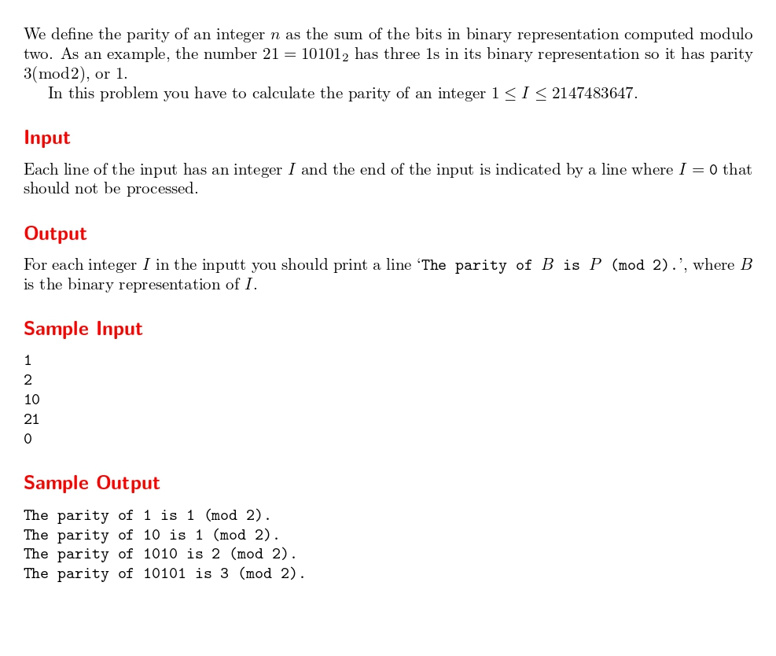

# Parity

題目連結:[Parity](https://onlinejudge.org/index.php?option=com_onlinejudge&Itemid=8&page=show_problem&category=24&problem=1872)


這題會輸入一連串的數字，要輸出各個數字的同位元(把數字轉成二進制後有幾個1)，直到輸入0停止。

我們先從轉換二進制開始，同時計算1的出現次數。

```C
char bin[32];
    int parity = 0, index = 0;
    while(n != 0){
        if(n % 2 == 1){
            parity++;
            bin[index] = '1';
        }
        else{
            bin[index] = '0';
        }
        n /=2 ;
        index++;
    }
```

之後再把位元由大到小輸出陣列的數字，這樣就完成轉換。

```C
#include <stdio.h>

int main(){

    int n;
    while(1){
        scanf("%d", &n);
        if(n == 0){
            break;
        }
            
        char bin[32];
        int parity = 0, index = 0;
        while(n != 0){
            if(n % 2 == 1){
                parity++;
                bin[index] = '1';
            }
            else{
                bin[index] = '0';
            }
            n /=2 ;
            index++;
        }
        
        printf("The parity of ");
        for(int i = index-1; i >= 0; i--){
            printf("%c", bin[i]);
        }
        printf(" is %d (mod 2).\n", parity);
    }
}
```