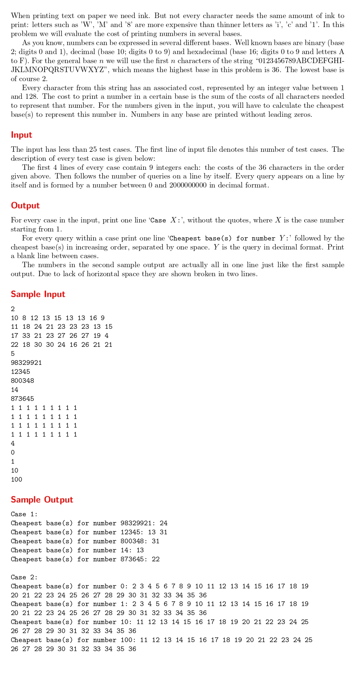

# Cheapest Base

題目連結:[Cheapest Base](https://onlinejudge.org/index.php?option=com_onlinejudge&Itemid=8&category=24&page=show_problem&problem=1946)


這題會給每個進位的墨水成本，求印出某數要用幾進位才最省。

先用陣列存每個進位的成本，再用迴圈暴力找2~36各自的成本並取最小的。
計算成本的方式: 取 number 餘數後再從成本的陣列對應出該位數的成本，直到數字為0。
```C
#include <stdio.h>

int get_cost(int number, int base, int cost[36]) {
    if (number == 0) return cost[0];
    
    int total = 0;
    while (number > 0) {
        int digit = number % base;
        total += cost[digit];
        number /= base;
    }
    return total;
}

int main() {
    int c;
    scanf("%d", &c);
    
    for (int case_id = 1; case_id <= c; case_id++) {
        int cost[36];
        for (int i = 0; i < 36; i++) {
            scanf("%d", &cost[i]);
        }

        int q;
        scanf("%d", &q);

        printf("Case %d:\n", case_id);

        while (q--) {
            int num;
            scanf("%d", &num);

            int min_cost = 9999999;
            int result[36], rsize = 0;

            for (int base = 2; base <= 36; base++) {
                int curr = get_cost(num, base, cost);
                if (curr < min_cost) {
                    min_cost = curr;
                    rsize = 0;
                    result[rsize++] = base;
                } else if (curr == min_cost) {
                    result[rsize++] = base;
                }
            }

            printf("Cheapest base(s) for number %d:", num);
            for (int i = 0; i < rsize; i++) {
                printf(" %d", result[i]);
            }
            printf("\n");
        }
		if(case_id != c){
			printf("\n");
		}
        
    }
}

```