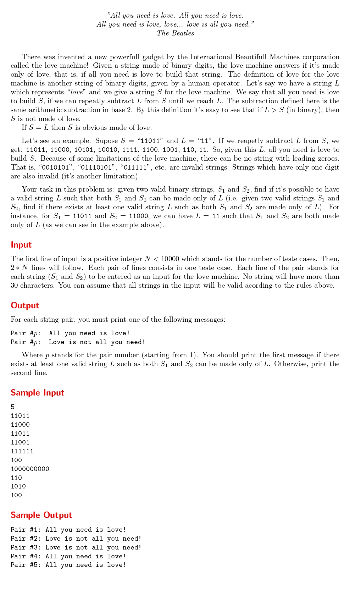

# All You Need Is Love

題目連結:[All You Need Is Love](https://onlinejudge.org/index.php?option=com_onlinejudge&Itemid=8&page=show_problem&problem=1134)


題目敘述繞了一大圈，但本質上是再問兩數是否互質。

我們先把題目給的輸入換成十進制(decimal)，要記得做字串轉換。

```C
int binToDec(char binary[]){
    int binaryLength = strlen(binary);
    int decmial = 0, index = 0;
    for(int i = binaryLength-1; i >= 0; i--){
        decmial += (binary[i] - '0') * pow(2, index);
        index++;
    }
    
    return decmial;
}
```

再來要透過最大公因數計算兩數是否互質。這邊若是用 c++ 跟 `bits/stdc++.h` 可以直接把數字丟到 `__gcd`, 純用 C 語言只能自己寫一個(好險這題沒別要求執行時間)

```C
int gcd(int a, int b) {
    if (b == 0)
        return a;
    return gcd(b, a % b);
}
```

再來透過 boolean 判斷要輸出哪個句子。

```C
#include <stdio.h>
#include <string.h>
#include <math.h>

#define MAX 1000

int gcd(int a, int b) {
    if (b == 0)
        return a;
    return gcd(b, a % b);
}

int binToDec(char binary[]){
    int binaryLength = strlen(binary);
    int decmial = 0, index = 0;
    for(int i = binaryLength-1; i >= 0; i--){
        decmial += (binary[i] - '0') * pow(2, index);
        index++;
    }
    
    return decmial;
}


int main(){
    int n;
    scanf("%d", &n);

    for(int p = 1; p <= n; p++){
        char s1[31], s2[31];
        scanf("%s %s",s1, s2);
        
        int S1 = binToDec(s1);
        int S2 = binToDec(s2);
        
        int isLove = 0;
        
        if(gcd(S1, S2) != 1){
            isLove = 1;
        }
        printf("Pair #%d: ", p);
        
        if(isLove == 1){
            printf("All you need is love!\n");
        }
        else{
            printf("Love is not all you need!\n");
        }
    }
}
```