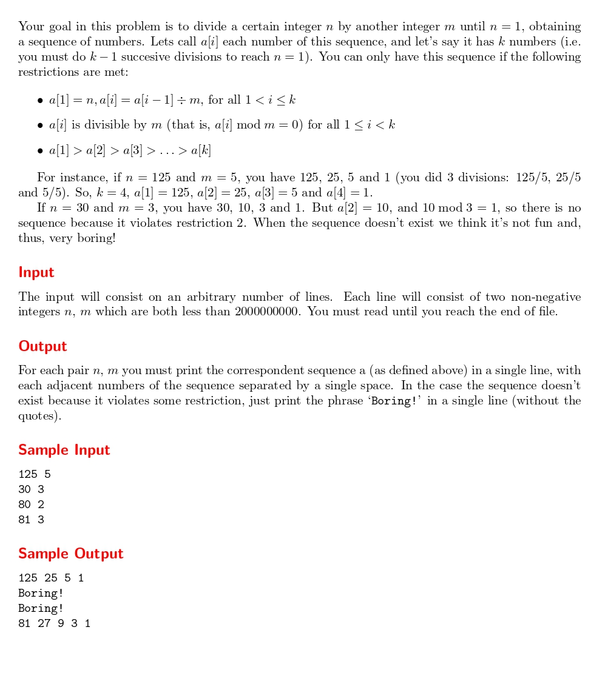

# Divide, But Not Quite Conquer!

題目連結:[Divide, But Not Quite Conquer!](https://onlinejudge.org/index.php?option=com_onlinejudge&Itemid=8&category=24&page=show_problem&problem=1131)


這題輸入整數 m 跟 n，m 要一直被 n 除直到 m = 1 , 若無法整除輸出 "Boring!"

這題的特點是要把整除的過程都輸出，但若失敗則指輸出 Boring，所以我們要用陣列來記錄每次除的結果。

首先判斷特殊案例，直接輸出 Boring 並跳回迴圈。
```C
if(n == 0 || m == 0 || m == 1){
            printf("Boring!\n");
            continue;
        }
```
再來用陣列紀錄每次除法的過程，並以`sequenceLength`紀錄陣列長度。
```C
int isBoring = 0;
        int devideSequence[MAX] = {0};
        devideSequence[0] = n;
        int sequenceLength = 1;
        
        while(n != 1){
            if(n % m == 0){
                devideSequence[sequenceLength] = n / m;
                n /= m;
            }
            else{
                isBoring = 1;
                break;
            }
            sequenceLength++;
        }
```
但若是最後沒有整除到 1 就不會輸出數列。
```C
        if(isBoring){
            printf("Boring!\n");
        }
        else{
            for(int i = 0; i < sequenceLength-1; i++){
                printf("%d ", devideSequence[i]);
            }
            printf("%d\n", devideSequence[sequenceLength-1]);
        }
```
```C
#include <stdio.h>
#include <string.h>

#define MAX 1000
int main()
{
    int n, m;
    
    while(scanf("%d %d", &n, &m) != EOF){
        if(n == 0 || m == 0 || m == 1){
            printf("Boring!\n");
            continue;
        }
        
        int isBoring = 0;
        int devideSequence[MAX] = {0};
        devideSequence[0] = n;
        int sequenceLength = 1;
        
        while(n != 1){
            if(n % m == 0){
                devideSequence[sequenceLength] = n / m;
                n /= m;
            }
            else{
                isBoring = 1;
                break;
            }
            sequenceLength++;
        }
        
        if(isBoring){
            printf("Boring!\n");
        }
        else{
            for(int i = 0; i < sequenceLength-1; i++){
                printf("%d ", devideSequence[i]);
            }
            printf("%d\n", devideSequence[sequenceLength-1]);
        }
        
        
    }
    
}

```
