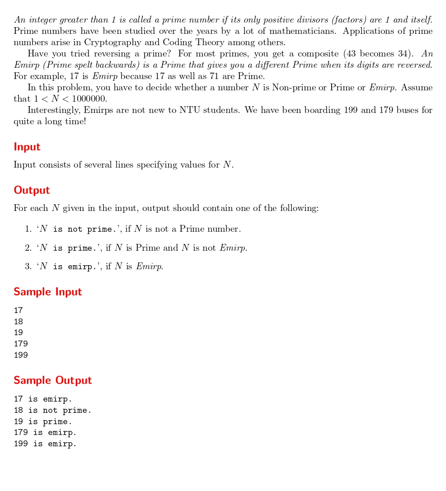

# Simply Emirp

題目連結:[Simply Emirp](https://onlinejudge.org/index.php?option=com_onlinejudge&Itemid=8&category=24&page=show_problem&problem=1176)


這題輸入數字判斷是否是質數，以及它倒過來後是不是質數(Emrip)。

我們先寫一個判斷是否是質數的函式:

```C
int Prime(int n){
    if(n == 1 || n == 0){
        return 0;
    }
    for(int i = 2; i*i <= n; i++){
        if(n % i == 0){
            return 0;
        }
    }
    
    return 1;
}
```

再寫一個判斷倒過來是不是也是質數的函式:

```C
int Emrip(int n){
    int temp_n = n;
    int reverse = 0;
    while(temp_n != 0){
        reverse = reverse * 10 + temp_n % 10;
        temp_n /= 10;
    }
    if(n == reverse){
        return 0;
    }
    else{
        return Prime(reverse);
    }
    
}
```
把數字倒過來後丟到剛剛寫的 Prime 即可。
題目有提到若倒過來的數字一樣不能算作 Emrip 所以要另外判斷數字是否相同。

最後根據條件輸出即可。
```C
#include <stdio.h>
#include <math.h>

int Prime(int n){
    if(n == 1 || n == 0){
        return 0;
    }
    for(int i = 2; i*i <= n; i++){
        if(n % i == 0){
            return 0;
        }
    }
    
    return 1;
}

int Emrip(int n){
    int temp_n = n;
    int reverse = 0;
    while(temp_n != 0){
        reverse = reverse * 10 + temp_n % 10;
        temp_n /= 10;
    }
    if(n == reverse){
        return 0;
    }
    else{
        return Prime(reverse);
    }
    
}


int main(){
    int n;
    while(scanf("%d", &n) != EOF){
        int isPrime = Prime(n), isEmrip = Emrip(n);
        if(isPrime&&isEmrip){
            printf("%d is emirp.\n", n);
        }
        else if(isPrime){
            printf("%d is prime.\n", n);
        }
        else{
            printf("%d is not prime.\n", n);
        }
    }
}
```