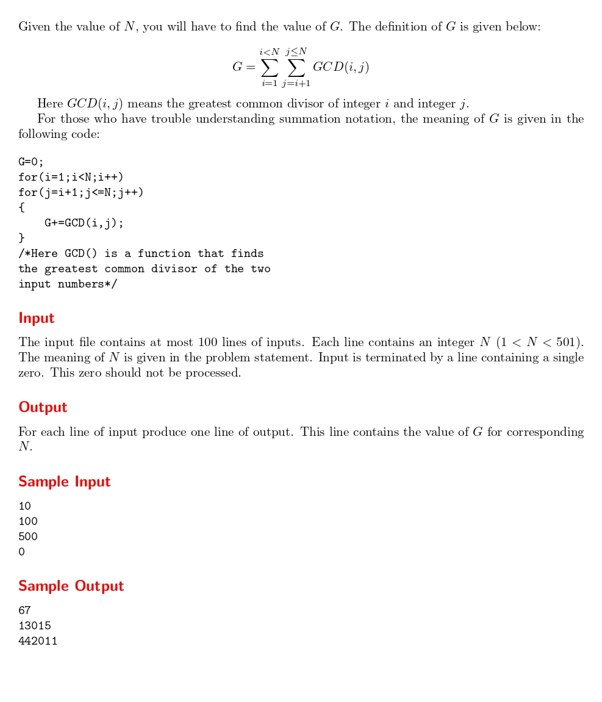

# GCD

題目連結:[GCD](https://onlinejudge.org/index.php?option=com_onlinejudge&Itemid=8&category=24&page=show_problem&problem=2412)


要按照題目求出 G。

這題最難的部分是時間限制，若是用 c++ 的 `__gcd` 就可以秒殺這題，但是在 C 沒有 GCD 函式可以用，所以這邊要用 Dynamic Programming 的方式來求 GCD。

```C
int gcd_data[10001][10001];

int gcd(int a, int b) {
    if (b == 0) return a;
    if (gcd_data[a][b]) return gcd_data[a][b];
    return gcd_data[a][b] = gcd(b, a % b);
}
```
透過之前存的 data 來求下一個 GCD。

再來就照題目要求算出G即可。

```C
#include <stdio.h>

int gcd_data[10001][10001];

int gcd(int a, int b) {
    if (b == 0) return a;
    if (gcd_data[a][b]) return gcd_data[a][b];
    return gcd_data[a][b] = gcd(b, a % b);
}


int main(){

    int n;
    
    while(1){
        scanf("%d", &n);
        if(n==0){
            break;
        }
        
        int g = 0;
        for(int i = 1; i < n; i++){
            for(int j = i+1; j <= n; j++){
                g += gcd(i, j);
            }
        }
        
        printf("%d\n", g);
    }
}
```

