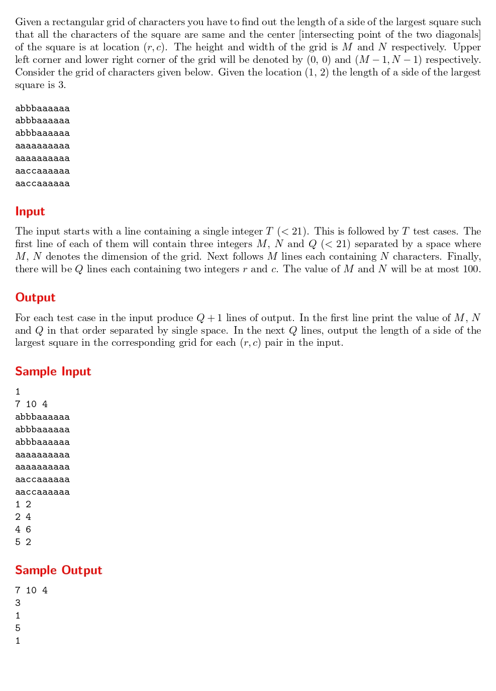

# Largest Square

題目連結:[Largest Square](https://onlinejudge.org/index.php?option=com_onlinejudge&Itemid=8&category=24&page=show_problem&problem=1849)


題目輸入由字母形成的矩形，要找出給定座標內為中心最大的正方形邊長。

以給定的座標為起點，由0開始逐步增加正方形長度，若座標超出範圍或讀到跟起始座標不同的字母代表越界，前一個長度就是最大正方形邊長。

```C
int unitLength = 0;

    while(1){
        int valid = 1;

        for(int i = r - unitLength; i <= r + unitLength && valid; i++){
            for(int j = c - unitLength; j <= c + unitLength; j++){
                if(outOfBounds(i, j, m, n) || square[i][j] != square[r][c]){
                    valid = 0;
                    break;
                }
            }
        }

        if(!valid){
            break;
        }

        unitLength++;
    }
```
最後的`unitLength*2-1`是因為跳出迴圈時是超出範圍的矩形長度，輸出時要調回上一個。
```C
#include <stdio.h>
#include <string.h>

int outOfBounds(int x, int y, int m, int n){ 
    return x < 0 || x >= m || y < 0 || y >= n;
}

int main(){
    int t;
    scanf("%d", &t);
    while(t--){
        int m, n, q;
        scanf("%d %d %d", &m, &n, &q);
        printf("%d %d %d\n", m, n, q);

        char square[m][n];
        for(int i = 0; i < m; i++){
            for(int j = 0; j < n; j++){
                scanf(" %c", &square[i][j]);
            }
        }
        
        while(q--){
            int r, c;
            scanf("%d %d", &r, &c);

            int unitLength = 0;

            while(1){
                int valid = 1;

                for(int i = r - unitLength; i <= r + unitLength && valid; i++){
                    for(int j = c - unitLength; j <= c + unitLength; j++){
                        if(outOfBounds(i, j, m, n) || square[i][j] != square[r][c]){
                            valid = 0;
                            break;
                        }
                    }
                }

                if(!valid){
                    break;
                }

                unitLength++;
            }

            printf("%d\n", unitLength * 2 - 1);
        }
    }

    return 0;
}

```