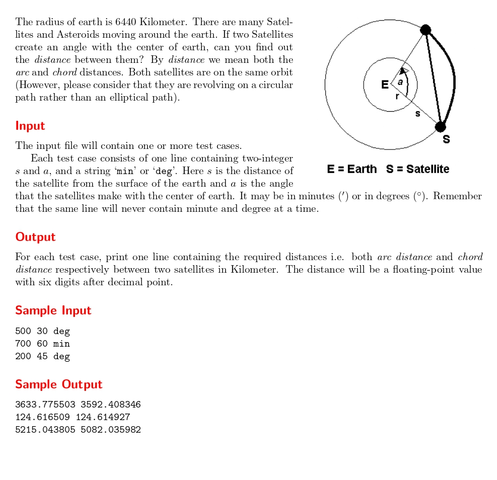

# Satellites

題目連結:[Satellites](https://onlinejudge.org/index.php?option=com_onlinejudge&Itemid=8&category=24&page=show_problem&problem=1162)


這題是要計算兩個衛星之間的距離(參考題目圖片)，要計算弧長(arc)跟弦長(chord)，題目會給衛星離地球的高度, 角度跟要用度(deg)還是分(min)為單位。

首先要加上地球的半徑 6440

`s += 6440;`

再來看題目要求的單位去做轉換

```C
if(!strcmp(angleUnit, "min")){
            a /= 60.0;
        }
        if (a > 180.0){
            a = 360.0 - a;
        }
```

再來是弧長(arc)跟弦長(chord)的公式:

$$arc = 2* \pi * r * \frac{a}{360}$$

$$
\text{chord} = 2r \cdot \sin\left( \frac{\theta}{2} \cdot \frac{\pi}{180} \right)
$$


```C
#include <stdio.h>
#include <math.h>
#include <string.h>

#define PI asin(1)*2.0

int main(){
    double s, a;
    char angleUnit[4];
    
    while(scanf("%lf %lf %s",&s ,&a, angleUnit) != EOF){
        s += 6440;
        
        if(!strcmp(angleUnit, "min")){
            a /= 60.0;
        }
        if (a > 180.0){
            a = 360.0 - a;
        }
        
        double arc_length = 2 * PI * s * a / 360.0; // 弧長
        double chord_length = 2 * s * sin((a / 2.0) * PI / 180.0); // 弦長
        
        printf("%lf %lf\n",arc_length, chord_length);
    }
}
```