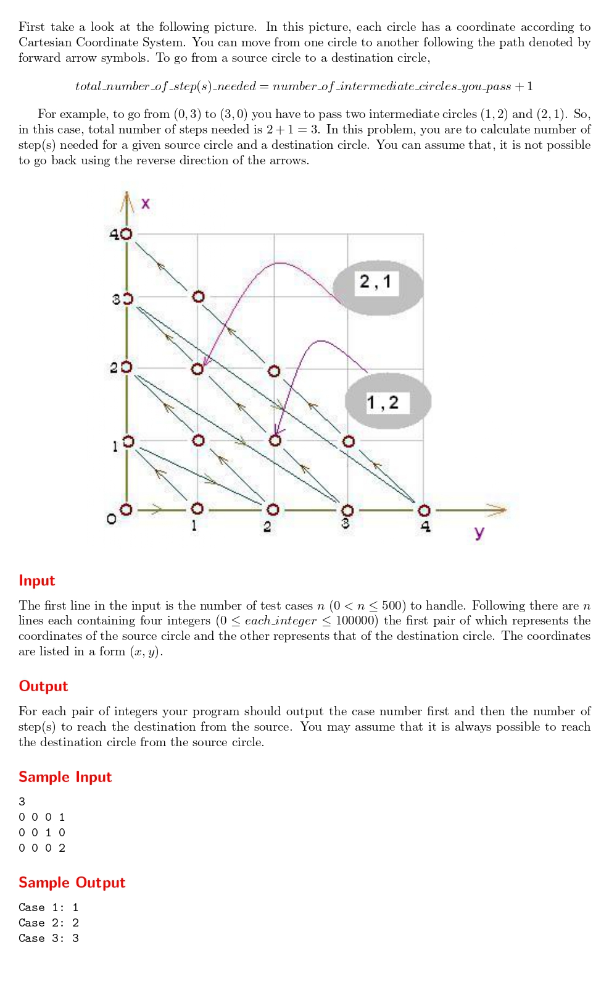

# Can You Solve It?

題目連結:[Can You Solve It?](https://onlinejudge.org/index.php?option=com_onlinejudge&Itemid=8&category=24&page=show_problem&problem=1583)


參考圖片，輸入兩個座標。題目會問兩個座標之間要經過多少格。

透過觀察，我們可以發現走到 (0, y) 需要走(1+2+3...+y)格，而 x 有值的話再加上去即可。
另外要注意數字可能會很大所以要設 long long int。
```C
#include <stdio.h>

long long int target(int x, int y){
    long long int basic = 0, extra = x;
    for(int i = 1; i <= x+y; i++){
        basic += i;
    }
    return basic + extra;
}

int main(){
    int n;
    scanf("%d", &n);
    
    for(int i = 1; i <= n; i++){
        int x1, y1, x2, y2;
        scanf("%d%d%d%d", &x1, &y1, &x2, &y2);
        printf("Case %d: %lld\n", i, target(x2, y2)-target(x1, y1));
    }
}

```