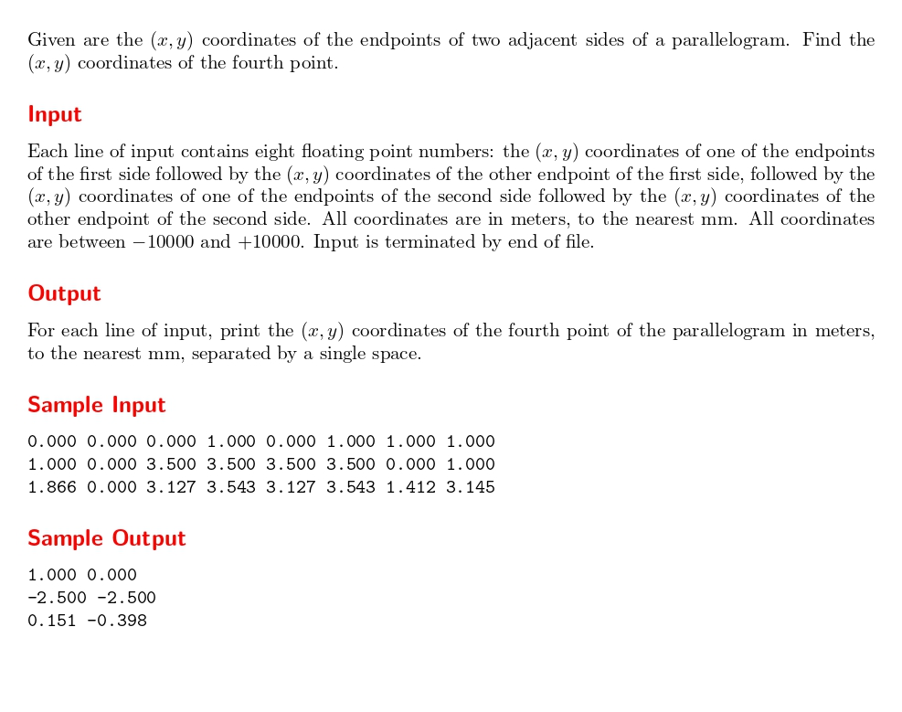
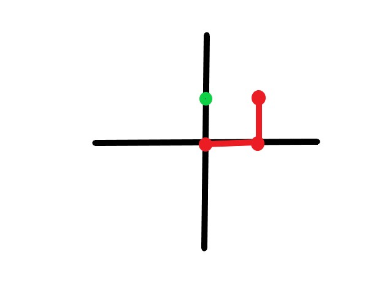

# Fourth Point !!

題目連結: [Fourth Point !!](https://onlinejudge.org/index.php?option=com_onlinejudge&Itemid=8&category=24&page=show_problem&problem=1183)




題目會給一個平行四邊形兩個邊各自的點，要找到第四點的座標。



以圖片來說明第一個測資，題目會輸入(0, 0), (0, 1), (0, 1), (1, 1) 這四個座標(以紅點標示)，其中有兩條邊，一條是(0, 0), (0, 1)，另一條是(0, 1), (1, 1)。現在要找到綠點的座標。

可以從 input 發現由於是輸入兩個邊的座標，導致一定會有兩個點是重複的。這也是我們找出第四點的關鍵。
求出第四點的方式: 四個點的座標相加 - 重複點座標*3

我們可以實際代入看看: (0, 0)+(0, 1)+(0, 1)+(1, 1)=(1, 3)。
重複點為(0, 1), (1, 3) - (0,1)*3 = (1, 0) 符合答案

現在把這個公式套到程式裡:

```C
#include <stdio.h>

int main(){
    double x[4], y[4];
    
    while(scanf("%lf%lf", &x[0], &y[0]) != EOF){
        double fourth_point_x = x[0], fourth_point_y = y[0];
        for(int i = 1; i < 4; i++){
            scanf("%lf", &x[i]); 
            scanf("%lf", &y[i]); 
            fourth_point_x += x[i];
            fourth_point_y += y[i];
        }
        
        int repeat_index;
        for(int i = 0; i < 4; i++){
            for(int j = i+1; j < 4; j++){
                if(x[i] == x[j] && y[i] == y[j]){
                    repeat_index = i;
                }
            }
        }
        
        fourth_point_x -= x[repeat_index]*3;
        fourth_point_y -= y[repeat_index]*3;
        
        printf("%.3f %.3f\n", fourth_point_x, fourth_point_y);
    }
}

```

透過 for 找到重複點的 index, 再照上面公式扣掉即可。