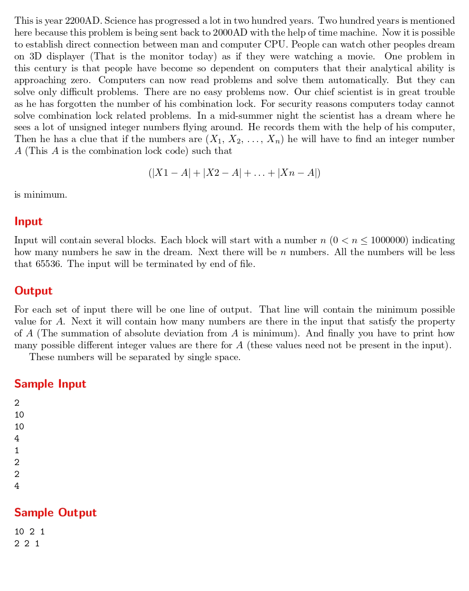

# A mid-summer night's dream.
題目連結: [A mid-summer night's dream.](https://onlinejudge.org/index.php?option=com_onlinejudge&Itemid=8&category=24&page=show_problem&problem=998)


這題故事背景很長，但只是問所有數字絕對值相減相加的最小值(也就是中位數)。但他還有問有幾個中位數與有幾個可能的數。

我們用類似解 Vito's family 的策略找中位數，然後再分成數列總數為偶數還奇數
* 偶數: mid = numberList[n/2-1], 找到numberList[n/2-1]與numberList[n/2]的數量，可能的值為 numberList[n/2]-numberList[n/2-1]+1
* 奇數: mid = numberList[n/2], 找到numberList[n/2-1]的數量，可能的值只有中位數一個。

```C
#include <stdio.h>
#include <string.h>

void bubble_sort(int arr[], int len){
    for(int i = 0; i < len; i++){
        for(int j = i+1; j < len; j++){
            if(arr[i] > arr[j]){
                int temp = arr[i];
                arr[i] = arr[j];
                arr[j] = temp;
            }
        }
    }
}


int main(){
    int n;
    while(scanf("%d", &n) != EOF){
        int numberList[n];
        for(int i = 0; i < n; i++){
            scanf("%d", &numberList[i]);
        }
        bubble_sort(numberList, n);
        int mid, count = 0, min;
        if(n%2 == 0){
            mid = numberList[n/2-1];
            count = 0;
            for(int i = 0; i < n; i++){
                if(numberList[i] == numberList[n/2] || numberList[i] == numberList[n/2-1]){
                    count++;
                }
            }
            min = numberList[n/2]-numberList[n/2-1]+1;
        }
        else{
            mid = (numberList[n/2]);
            for(int i = 0; i < n; i++){
                if(numberList[i] == numberList[n/2]){
                    count++;
                }
            }
            min = 1;
        }
        printf("%d %d %d\n", mid, count, min);
    }
}

```