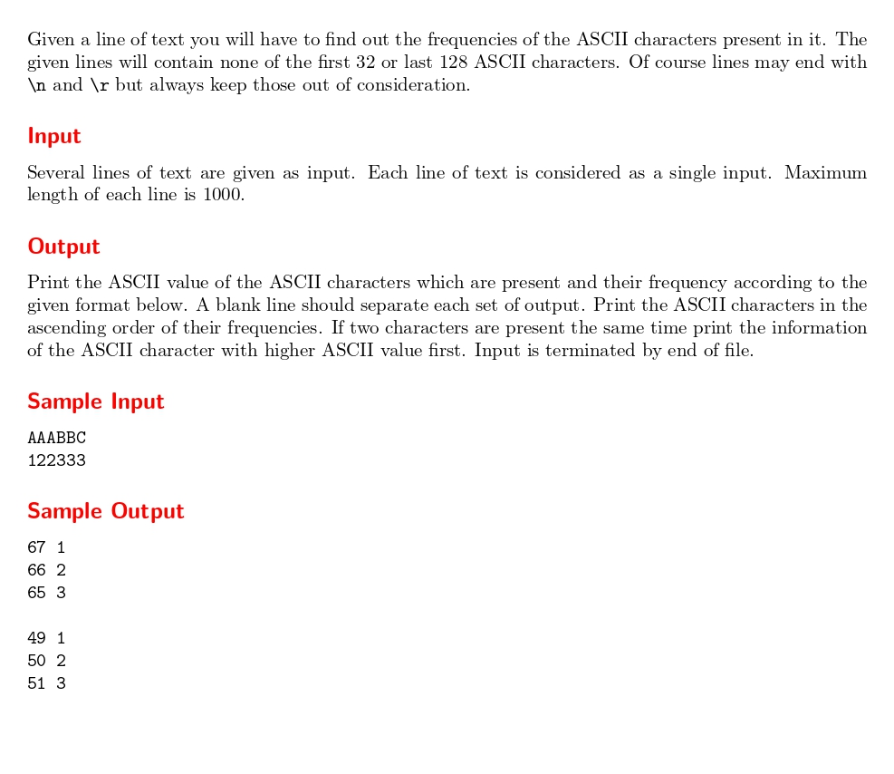

# Tell me the frequencies!

題目連結: [Tell me the frequencies!](https://onlinejudge.org/index.php?option=com_onlinejudge&Itemid=8&category=24&page=show_problem&problem=1003)


輸入字串，並記錄各個字元出現的次數，以ACII由小到大顯示，若次數一樣以ACII值較大者優先。

這題開記住 ACII 出現次數的陣列，每次出現就再對應的ACII的位子++，再由大到小走訪ACII並輸出有出現的字即可。
```C
int ASCIICount[130] = {0};
        for(int i = 0; i < strlen(str); i++){
            ASCIICount[str[i]]++;
        }
        
        for(int i = 1; i <= strlen(str); i++){
            for(int j = 128; j >= 0; j--){
                if(ASCIICount[j] == i){
                    printf("%d %d\n", j, i);
                }
            }
        }
```

這題最麻煩的是輸出格式，不同字串之間要空一行，但最後一行不能換行。
我這邊的作法是在開頭的時候換行，用 flag 避免換到第一行，這樣就可以在處理新字串之前換行，但處理到最後一個的時候會因為跳出迴圈而不會換行。
```C
#include <stdio.h>
#include <string.h>

int main(){
    char str[1001];
    int flag = 0;
    while(gets(str)){
        if(flag){
            printf("\n");
        }
        flag = 1;
        int ASCIICount[130] = {0};
        for(int i = 0; i < strlen(str); i++){
            ASCIICount[str[i]]++;
        }
        
        for(int i = 1; i <= strlen(str); i++){
            for(int j = 128; j >= 0; j--){
                if(ASCIICount[j] == i){
                    printf("%d %d\n", j, i);
                }
            }
        }
    }
}
```