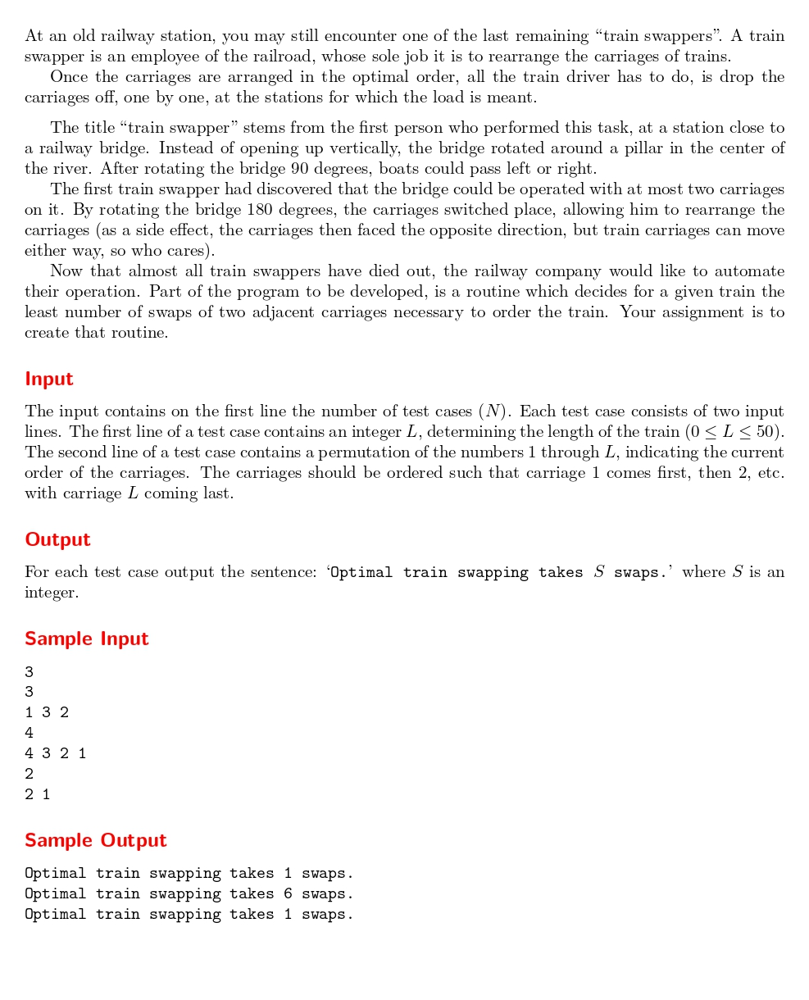

# Train Swapping

題目連結: [Train Swapping](https://onlinejudge.org/index.php?option=com_onlinejudge&Itemid=8&category=24&page=show_problem&problem=235)


這題會輸入一個數列(火車車廂的編號)，要輸出要交換幾次才能把火車排好。這其實就是在問用 bubble sort 要交換幾次才能把數字排列好。

我們可以先寫一個 bubble sort 的函式

```C
int swap_count(int train[], int train_len){
    int swap_count = 0, temp;
    for(int i = 0; i < train_len; i++){
        for(int j = i+1; j < train_len; j++){
            if(train[i] > train[j]){
                temp = train[i];
                train[i] = train[j];
                train[j] = temp;
                swap_count++;
            }
        }
    }
    return swap_count;
}
```

在後面判斷要交換的時候 `swap_count++` 來紀錄交換幾次，再回傳該值即可。

```C
#include <stdio.h>

int swap_count(int train[], int train_len){
    int swap_count = 0, temp;
    for(int i = 0; i < train_len; i++){
        for(int j = i+1; j < train_len; j++){
            if(train[i] > train[j]){
                temp = train[i];
                train[i] = train[j];
                train[j] = temp;
                swap_count++;
            }
        }
    }
    return swap_count;
}

int main(){
    int n;
    scanf("%d", &n);
    while(n--){
        int train_len;
        scanf("%d", &train_len);
        
        int train[train_len];
        for(int i = 0; i < train_len; i++){
            scanf("%d", &train[i]);
        }
        
        int S = swap_count(train, train_len);
        
    printf("Optimal train swapping takes %d swaps.\n", S);
    }
}
```

