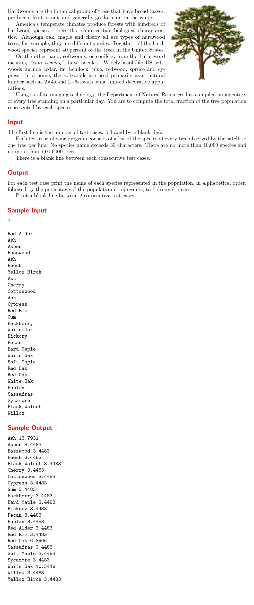

# Hardwood Species

題目連結: [Hardwood Species](https://onlinejudge.org/index.php?option=com_onlinejudge&Itemid=8&category=24&page=show_problem&problem=1167)


這題輸入樹木名稱，計算每個樹木佔全部輸入的樹木的百分比。
這題非常適合用 map 計算，所以也會是少數用 c++ 解的題目之一。

首先要輸入測資數，由於後面會空行所以要用 cin.ignore 避免資料錯誤。

```Cpp
int testCases;
    cin >> testCases;
    cin.ignore();
    cin.ignore();
```

再來用 map 的方式紀錄，這可以把樹的名稱作為 key，出現次數作為 value 對應。代表只要每次輸入的時候在 map++ 就可以紀錄各個樹木的出現次數，這如果在 C 做會很麻煩。
另外要記錄 `treeCount` 作為輸入樹木的總次數。
後面用 for 走訪整個 `treeList`，i.first 是 string(樹的名稱)，i.second 是樹的出現次數。把 i.second / treeCount 就是比例。

最後可以發現我混用 cout 跟 printf，這就是之前在 List of Conquest 那題提到的 c++ 方便的地方，由於題目要求輸出小數點，但 C++ 限制小數點的方式麻煩且不直覺，這個時候就可以跟 printf 混用。
```cpp
while(testCases--){
        map<string, int> treeList;
        string tree;
        double treeCount = 0;
        while(getline(cin, tree) && tree != ""){
            treeList[tree]++;
            treeCount++;
        }
        for(auto i: treeList){
            cout << i.first << ' ';
            printf("%.4f\n", (i.second/treeCount) * 100);
        }
        if(testCases != 0){
            printf("\n");
        }
    }
```

```cpp
#include <bits//stdc++.h>

using namespace std;

int main(){
    int testCases;
    cin >> testCases;
    cin.ignore();
    cin.ignore();
    while(testCases--){
        map<string, int> treeList;
        string tree;
        double treeCount = 0;
        while(getline(cin, tree) && tree != ""){
            treeList[tree]++;
            treeCount++;
        }
        for(auto i: treeList){
            cout << i.first << ' ';
            printf("%.4f\n", (i.second/treeCount) * 100);
        }
        if(testCases != 0){
            printf("\n");
        }
    }
}
```