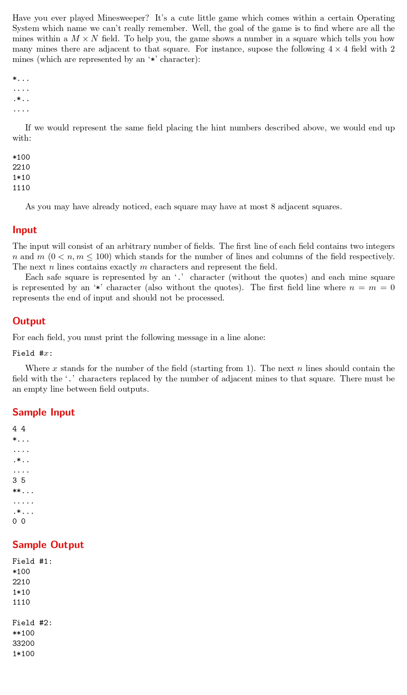

# Minesweeper
題目連結: [Minesweeper](https://onlinejudge.org/index.php?option=com_onlinejudge&Itemid=8&category=24&page=show_problem&problem=1130)


這題會給陣列大小，以及地雷位置圖( * 為地雷， . 不是地雷)，要輸出每個 . 距離1格周圍有幾個地雷。

讀入陣列後，用 i, j 迴圈走訪陣列每個元素，再用 k, l 迴圈找該點周圍8個點有沒有地雷，有地雷就累加 counter。最後紀錄累計的值(因為陣列是 char 要+ '0')。

```C
char field[n][m];
        
        for(int i = 0; i < n; i++){
            for(int j = 0; j < m; j++){
                scanf(" %c", &field[i][j]);
            }
        }
        
        for(int i = 0; i < n; i++){
            for(int j = 0; j < m; j++){
                int minesweeper = 0;
                for(int k = -1; k <= 1; k++){
                    for(int l = -1; l <= 1; l++){
                        if(i+k < 0 || i+k >= n || j+l < 0 || j+l >= m){
                            continue;
                        }
                        else if(field[i+k][j+l] == '*'){
                            minesweeper++;
                        }
                    }
                }
                if(field[i][j] == '*'){
                    field[i][j] = '*';
                }
                else{
                    field[i][j] = minesweeper+'0';
                }
                
            }
        }
```

這題跟 Tell me the frequencies! 一樣測資之間要空行但最後一個測資不空。用類似的方式在開頭換行用 flag 判斷。

```C
#include <stdio.h>

int main(){
    int n, m;
    int fieldCount = 1;
    int flag = 0;
    while(1){
        scanf("%d %d", &n, &m);
        if(n == 0 || m == 0){
            break;
        }
        else if(flag == 1){
            printf("\n");
        }
        
        char field[n][m];
        
        for(int i = 0; i < n; i++){
            for(int j = 0; j < m; j++){
                scanf(" %c", &field[i][j]);
            }
        }
        
        for(int i = 0; i < n; i++){
            for(int j = 0; j < m; j++){
                int minesweeper = 0;
                for(int k = -1; k <= 1; k++){
                    for(int l = -1; l <= 1; l++){
                        if(i+k < 0 || i+k >= n || j+l < 0 || j+l >= m){
                            continue;
                        }
                        else if(field[i+k][j+l] == '*'){
                            minesweeper++;
                        }
                    }
                }
                if(field[i][j] == '*'){
                    field[i][j] = '*';
                }
                else{
                    field[i][j] = minesweeper+'0';
                }
                
            }
        }
        
        printf("Field #%d:\n", fieldCount);
        for(int i = 0; i < n; i++){
            for(int j = 0; j < m; j++){
                printf("%c", field[i][j]);
            }
            printf("\n");
        }
        fieldCount++;
        flag = 1;
    }
}


```