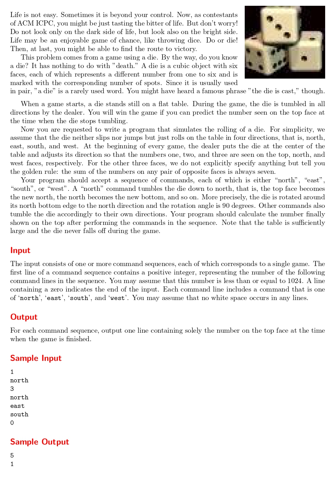

# Die Game

題目連結: [Die Game](https://onlinejudge.org/index.php?option=com_onlinejudge&Itemid=8&category=24&page=show_problem&problem=1350)


題目預設骰子頂面是1, 北面是2, 西面是3，並給你"任何一對相對的面的數字總和始終為7"這個資訊。
輸入指令數與指令，問在執行指令後頂面上數字是幾。

我們先用 int 裝頂面、北面、西面的數字，再用 char[]裝指令。然後透過題目提供的法則去模擬骰子移動後各個面的數字即可。

```C
#include <stdio.h>
#include <string.h>

int main(){
    int n;
    while(1){
        scanf("%d", &n);
        if(n == 0){
            break;
        }
        
        int top = 1;
        int north = 2, west = 3;
        char command[6];
        for(int i = 0; i < n; i++){
            int temp_top = top;
            scanf("%s", command);
            if(strcmp(command, "east") == 0){
                top = west;
                west = 7-temp_top;
            }
            else if(strcmp(command, "west") == 0){
                top = 7-west;
                west = temp_top;
            }
            else if(strcmp(command, "south") == 0){
                top = north;
                north = 7-temp_top;
            }
            else if(strcmp(command, "north") == 0){
                top = 7-north;
                north = temp_top;
            }
        }
        printf("%d\n", top);
    }
}

```
