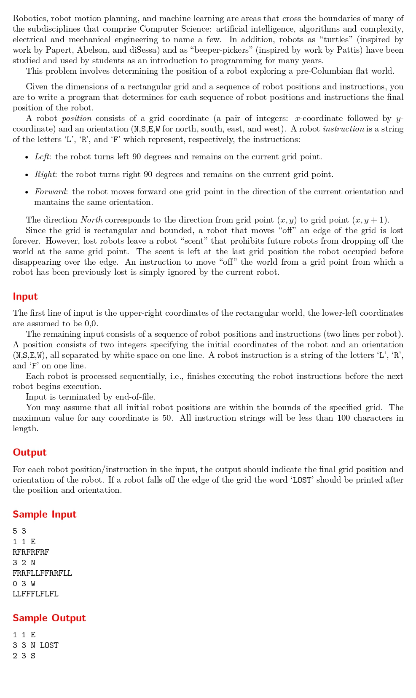

# Mutant Flatworld Explorers

題目連結: [Mutant Flatworld Explorers](https://onlinejudge.org/index.php?option=com_onlinejudge&Itemid=8&category=24&page=show_problem&problem=54)


這題要模擬機器人走路，會有指令:左(L), 右( R ), 前進(F)。會給座標大小與起始座標方位，求出執行完後走到哪個座標。若越界要輸出它再越界前的最後座標並輸出 LOST，並記錄此座標避免再掉下去。

首先分別為左轉跟右轉的行為抽成函式:
```C
char directionChangeLeft(char direction){
    if(direction == 'E'){
        direction = 'N';
    }
    else if(direction == 'N'){
        direction = 'W';
    }
    else if(direction == 'W'){
        direction = 'S';
    }
    else if(direction == 'S'){
        direction = 'E';
    }
    
    return direction;
}

char directionChangeRight(char direction){
    if(direction == 'E'){
        direction = 'S';
    }
    else if(direction == 'S'){
        direction = 'W';
    }
    else if(direction == 'W'){
        direction = 'N';
    }
    else if(direction == 'N'){
        direction = 'E';
    }
    
    return direction;
}
```
再來用 char 輸入指令，並逐個讀取，前進的時候依照目前方位加減 x, y 座標，若機器人掉下去先依照方位退回上一步，並記錄掉下去前的座標，之後若遇到該座標機器人會忽略。
```C
int main(){
    int topX, topY;
    scanf("%d %d", &topX, &topY);

    int isLost[100][100] = {0};
    int x, y;
    char direction;
    char commend[100];
    while(scanf("%d %d %c", &x, &y, &direction) != EOF){
        int isFall = 0;
        scanf("%s", commend);
        
        for(int i = 0; i < strlen(commend); i++){
            if(commend[i] == 'L'){
                direction = directionChangeLeft(direction);
            }
            else if(commend[i] == 'R'){
                direction = directionChangeRight(direction);
            }
            else if(commend[i] == 'F'){
                if(direction == 'E'){
                    x++;
                }
                else if(direction == 'N'){
                    y++;
                }
                else if(direction == 'W'){
                    x--;
                }
                else if(direction == 'S'){
                    y--;
                }
            }
            
            if(x<0 || x>topX || y<0 || y>topY){
                if(direction == 'E'){
                    x--;
                }
                else if(direction == 'N'){
                    y--;
                }
                else if(direction == 'W'){
                    x++;
                }
                else if(direction == 'S'){
                    y++;
                }
                
                if(isLost[x][y] == 1){
                    continue;
                }
                
                isLost[x][y] = 1;
                isFall = 1;
                break;
            }
        }
        if(isFall){
            printf("%d %d %c LOST\n", x, y, direction);
        }
        else{
            printf("%d %d %c\n", x, y, direction);
        }
    
    }
}
```