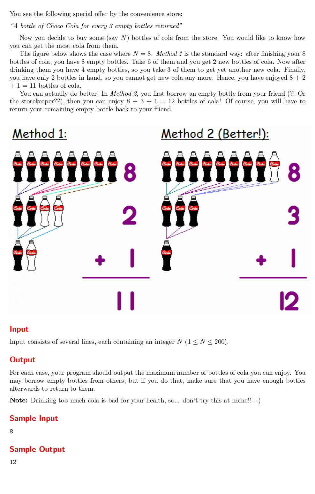

# Cola

題目連結: [Cola](https://onlinejudge.org/index.php?option=com_onlinejudge&Itemid=8&category=24&page=show_problem&problem=2091)


三瓶空可樂瓶可以換一瓶新的可樂，給起始的可樂數，問最多可以喝到的可樂數(在差一瓶的情況下可以借空瓶)

以題目的 8 瓶舉例:

1. 初始有 8 瓶，差一瓶就有 9 瓶可以換所以借空罐，總共換 9/3=3 瓶
2. 目前喝8+3=11瓶，3/3=1
3. 11+1=12，總共12瓶。

我們可以把剛剛的過程換成以下程式:

```C
#include <stdio.h>

int main(){

    int n;
    
    while(scanf("%d", &n) != EOF){
        int result = n; // 一開始喝的瓶數
        while(n >= 3){
            result += n/3; // 換罐子喝的瓶數
            n = (n/3) + (n%3); // 喝的瓶數 + 空瓶數 
        }
        if(n == 2){  // 換空罐
            result++;
        }
        printf("%d\n", result);
    }
}
```

不過這題由於題目說輸入的 n 會在 200 以下，我們可以直接轉換成公式解:

```C
#include <stdio.h>

int main(){

    int n;
    
    while(scanf("%d", &n) != EOF){
        printf("%d\n", n*3/2);
    }
}
```


