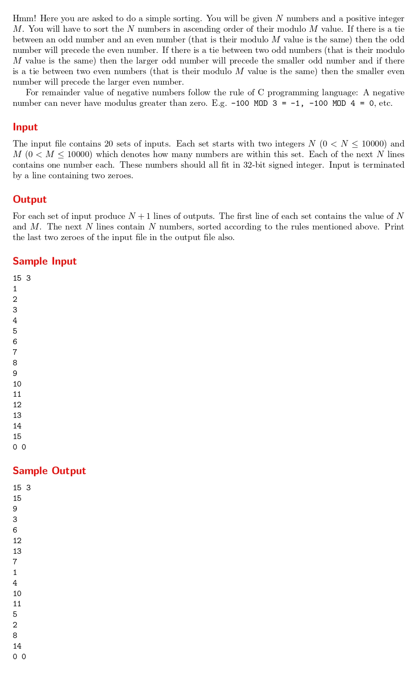

# Sort! Sort!! and Sort!!!

題目連結: [Sort! Sort!! and Sort!!!
](https://onlinejudge.org/index.php?option=onlinejudge&page=show_problem&problem=2296)


這題要排序，但是要遵照題目的規定，題目首先會輸入 N 跟 M:

1. 先以數字 mod M 的值由小到大排
2. 若餘數相等且比較的兩數為一奇一偶: 奇數在前
3. 餘數相等且都是奇數或都是偶數: 數字大的在前

這邊我們會用到 `qsort(void *base, size_t nitems, size_t size, int (*compar)(const void *, const void*))`，base 填 array, nitems 填陣列大小, size 填一個元素的大小, 而剩下那個 compar 就是這題的關鍵。

我們可以透過 compar 內的函數來自訂排序的邏輯，而這個就是本題的要求。

依照本題的要求寫出 cmp 函式

```C
int n, m;

int isOdd(int n){
    int num = abs(n % 2);
    return num;
}

int cmp(const void *a, const void *b) {
    int x = *(int*)a;
    int y = *(int*)b;

    int modx = x % m;
    int mody = y % m;

    if (modx != mody)
        return modx - mody;

    int oddx = isOdd(x);
    int oddy = isOdd(y);

    if (oddx != oddy)
        return oddy - oddx;

    if (oddx)
        return y - x;
    else
        return x - y;
}
```

在套到qsort即可。
```C
#include <stdio.h>
#include <stdlib.h>

int n, m;

int isOdd(int n){
    int num = abs(n % 2);
    return num;
}

int cmp(const void *a, const void *b) {
    int x = *(int*)a;
    int y = *(int*)b;

    int modx = x % m;
    int mody = y % m;

    if (modx != mody)
        return modx - mody;

    int oddx = isOdd(x);
    int oddy = isOdd(y);

    if (oddx != oddy)
        return oddy - oddx;

    if (oddx)
        return y - x;
    else
        return x - y;
}

int main(){
    while(1){
        scanf("%d %d", &n, &m);
        if(n == 0 && m == 0){
            break;
        }
        
        int number[n];
        for(int i = 0; i < n; i++){
            scanf("%d", &number[i]);
        }
        printf("%d %d\n", n, m);

        qsort(number, n, sizeof(int), cmp);
        
        for(int i = 0; i < n; i++){
            printf("%d\n", number[i]);
        }
    }
    printf("0 0\n");
}
```